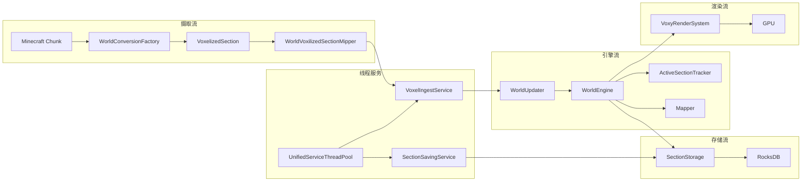

# Voxy 架构分析总结

## 概述

本文档汇总 Voxy 模组各子系统的关键设计决策，作为快速参考索引。

## LOD 世界引擎

| 设计点 | 实现 | 优势 |
|--------|------|------|
| Section 大小 | 32³ | 平衡内存占用与批量处理效率 |
| LOD 层数 | 5 层 (0-4) | 覆盖 32³ 到 512³ 的完整距离范围 |
| 数据编码 | 37 bits/voxel | 紧凑存储，支持超百万方块状态 |
| 并发控制 | VarHandle + StampedLock | 高效无锁读，写锁分片优化 |
| 缓存策略 | 双层 LRU | 热数据在内存，冷数据保留数组复用 |
| 引用计数 | atomicState 位操作 | 零额外开销的精确引用追踪 |

### 64-bit Section ID 布局

```
bits [63..60] = level (4 bits, 0-15)
bits [59..52] = y (8 bits, 0-255)
bits [51..28] = z (24 bits, 0-16M)
bits [27..4]  = x (24 bits, 0-16M)
bits [3..0]   = reserved (4 bits)
```

### 37-bit Voxel 编码

```
bits 56-63: light     (8 bits)  — 方块光(4) + 天空光(4)
bits 47-55: biome     (9 bits)  — 512 种生物群系
bits 27-46: block     (20 bits) — ~100 万种方块状态
```

## 体素化系统

| 组件 | 设计决策 |
|------|----------|
| VoxelizedSection | 16³ + 8³ + 4³ + 2³ + 1 = 4681 longs |
| 缓存策略 | ThreadLocal 避免锁竞争 |
| Palette 处理 | GlobalPalette/LinearPalette/HashMapPalette/LithiumHashPalette |
| Mipper 合并 | 优先非空气 + 不透明度 + 角落位编码 |

### Mipper 合并优先级

```
I111 (1,1,1) > I110 (1,1,0) > I011 (1,0,1) > I010 (1,0,0)
> I101 (0,1,1) > I100 (0,1,0) > I001 (0,0,1) > I000 (0,0,0)
```

## 持久化存储

| 维度 | 实现 |
|------|------|
| 存储引擎 | RocksDB + LMDB + Redis + Memory 多后端 |
| 压缩 | LZ4（速度优先）/ ZSTD（压缩率优先） |
| 索引 | BloomFilter (10 bits) + HyperClockCache (128MB) |
| 持久化 | WAL 128MB 保证数据安全 |
| 版本兼容 | DataFixerUpper 支持跨版本迁移 |
| Section 格式 | RLE + LUT 压缩 |

### Column Family 配置

```
world_sections CF: NO 压缩 (LZ4 外层处理)
id_mappings CF:    ZSTD 压缩
default CF:       ZSTD 压缩
```

## 线程模型

| 组件 | 参数 |
|------|------|
| Worker 线程数 | 3 个专用线程 |
| 线程优先级 | Priority 3 (低于正常) |
| VoxelIngestService | weight=5000，队列无硬限制 |
| SectionSavingService | weight=100，软上限 5000，硬上限 1200 |
| 工作窃取 | `steal()` 跨 Service 转移任务 |
| 选取算法 | 加权随机 + shiftFactor 防饿死 |

### ServiceManager 选取语义

| 返回值 | 含义 |
|--------|------|
| 0 | 成功执行了一个任务 |
| 1 | 无任务或无 Service |
| 2 | 所有 Service 队列为空 |
| 3 | 部分 Service 被 limiter 跳过 |

## 渲染核心

| 必需特性 | 说明 |
|----------|------|
| `compute` | glDispatchComputeIndirect |
| `indirectParameters` | GL_ARB_multi_draw_elements_indirect_count |
| 无 AMD Bug | hasBrokenDepthSampler = false |

### 厂商检测与特殊处理

```
INT64_t:     实际编译着色器验证（非仅检查扩展标志）
subgroup:    实际编译着色器验证
AMD Bug:     深度采样运行时测试，检测到则禁用模组
```

### MDIC 渲染限制

```
OPAQUE_DRAW_COUNT:      400,000 不透明绘制调用
TRANSLUCENT_DRAW_COUNT: 100,000 半透明绘制调用
TEMPORAL_DRAW_COUNT:    100,000 时序绘制调用
```

## 世界导入

| 导入器 | 线程配置 | 背压控制 |
|--------|----------|----------|
| WorldImporter | 1 main + 3 service | 队列差值 > 10,000 等待 |
| DHImporter | 1 runner + 10 service | 任务队列 > 100 等待 |

### DHImporter 数据库 Schema

```sql
SELECT Data, ColumnGenerationStep, Mapping
FROM FullData
WHERE DetailLevel = 0 AND PosX = ? AND PosZ = ?;
```

## 配置系统

| 层次 | 文件 | 作用域 |
|------|------|--------|
| 客户端配置 | `voxy-config.json` | 全局 |
| 世界级配置 | `world-configs.json` | 每个世界 |
| 存储配置 | `config.json` | 每个世界 |

### 序列化机制

- Gson TypeAdapterFactory 实现多态序列化
- `TYPE` 字段标识具体子类型
- 自动注册：扫描 `me.cortex.voxy.*` 包下含 "config" 的类

### 默认存储配置

```
RocksDBStorageBackend
  + CompressionStorageAdaptor(ZSTD, level=1)
    + SectionSerializationStorage
```

## 子系统交互图



## 参考

| 文档 | 源码路径 |
|------|----------|
| 架构总览 | `common/world/`, `common/thread/`, `common/config/` |
| 体素化 | `common/voxelization/`, `common/world/other/Mipper.java` |
| 存储 | `common/config/storage/`, `common/config/section/` |
| 线程 | `common/thread/`, `common/world/service/` |
| 渲染 | `client/core/`, `client/mixin/` |
| 导入 | `commonImpl/importers/` |
| 配置 | `common/config/`, `client/config/` |
