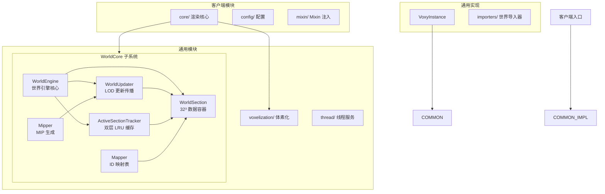
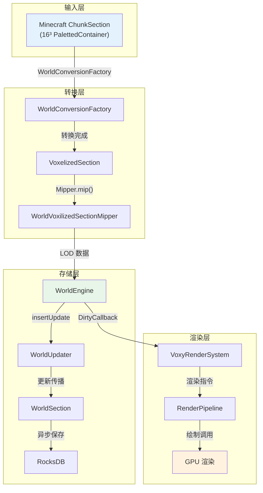

> 本文档为 Voxy 模组学习笔记，基于源码分析编写。感谢原作者 **Cortex** 的开源贡献。

## 目录

- [什么是 LOD？](#什么是-lod)
- [Minecraft 原版渲染 vs Voxy LOD](#minecraft-原版渲染-vs-voxy-lod)
- [Voxy 5 级 LOD 层级详解](#voxy-5-级-lod-层级详解)
- [Voxy 核心组件一览](#voxy-核心组件一览)
- [Voxy 数据流总览](#voxy-数据流总览)
- [适用读者与前置知识](#适用读者与前置知识)
- [课后自查](#课后自查)

---

## 什么是 LOD？

**LOD（Level of Detail）** 是一种图形渲染优化技术。它的核心思想是：

> 根据物体与摄像机的距离，动态切换不同精度的模型/数据。远距离使用简化版本，节省计算资源。

### 为什么 Minecraft 需要 LOD？

| 渲染距离 | 原版最大区块数 | 内存占用 | FPS 压力 |
|----------|---------------|----------|----------|
| 16 chunks | ~400 | 中等 | 适中 |
| 32 chunks | ~1600 | 翻倍 | 翻倍 |
| 64 chunks | ~6400 | 4倍 | 卡顿 |

原版 Minecraft 所有距离使用相同精度，远处的精细渲染是**巨大的浪费**。

### LOD 的直观理解

```
近处：每块石头单独渲染 → 高精度
远处：8×8×8 石头合并为 1 块 → 低精度
```

---

## Minecraft 原版渲染 vs Voxy LOD

### 原版 Minecraft

```
┌─────────────────────────────────────────────────────────┐
│                    Minecraft 原版                        │
├─────────────────────────────────────────────────────────┤
│                                                          │
│   ChunkSection (16³)    ChunkSection (16³)    ...       │
│   ┌─────────────┐      ┌─────────────┐                  │
│   │ ■ ■ ■ ■ ■ ■ │      │ ■ ■ ■ ■ ■ ■ │                  │
│   │ ■ ■ ■ ■ ■ ■ │      │ ■ ■ ■ ■ ■ ■ │                  │
│   │ ■ ■ ■ ■ ■ ■ │      │ ■ ■ ■ ■ ■ ■ │                  │
│   └─────────────┘      └─────────────┘                  │
│                                                          │
│   渲染精度: 100%          渲染精度: 100%                 │
│   距离: 16 blocks        距离: 256 blocks               │
│                                                          │
│   ⚠️ 远处仍然渲染全部细节 → 性能浪费                      │
└─────────────────────────────────────────────────────────┘
```

### Voxy LOD 渲染

```
┌─────────────────────────────────────────────────────────┐
│                    Voxy LOD 渲染                        │
├─────────────────────────────────────────────────────────┤
│                                                          │
│   Level 0 (32³)     Level 1 (64³)    Level 2 (128³)    │
│   ┌───────────┐     ┌───────────┐     ┌───────────┐   │
│   │ ■ ■ ■ ■   │     │    ■      │     │     ■     │   │
│   │ ■ ■ ■ ■   │     │    ■      │     │     ■     │   │
│   │ ■ ■ ■ ■   │     └───────────┘     └───────────┘   │
│   └───────────┘                                         │
│                                                          │
│   精度: 100%        精度: 12.5%       精度: 1.5%         │
│   距离: 32 blocks   距离: 64 blocks   距离: 256 blocks  │
│                                                          │
│   ✅ 远处使用简化数据 → 性能优化                         │
└─────────────────────────────────────────────────────────┘
```

---

## Voxy 5 级 LOD 层级详解

Voxy 将世界划分为 **5 个 LOD 层级（Level 0-4）**，每个层级代表不同的细节级别：

| 层级 | Section 大小 | 覆盖范围 | 压缩比 | 实际覆盖 |
|------|-------------|----------|--------|----------|
| **Level 0** | 32³ | 32³ | 1:1 | 原始精度，近距离渲染 |
| **Level 1** | 32³ | 64³ | 1:8 | 2×2×2 合并 |
| **Level 2** | 32³ | 128³ | 1:64 | 4×4×4 合并 |
| **Level 3** | 32³ | 256³ | 1:512 | 8×8×8 合并 |
| **Level 4** | 32³ | 512³ | 1:4096 | 16×16×16 合并 |

### 覆盖范围可视化

```
Level 0:  ████ 32³
Level 1:  ████████████████ 64³
Level 2:  ████████████████████████████████ 128³
Level 3:  ████████████████████████████████████████████████████████████████ 256³
Level 4:  █████████████████████████████████████████████████████████████████... 512³
          └─────────────────────────────────────────────────────────────────┘
                                              地平线
```

### 关键发现

- **每个 Level N 的 section 覆盖 2^(N+1) 个 Level 0 sections**
- Level 4 的一个 section 覆盖 **512×512×64 = 16,777,216** 个方块位置
- 这使得渲染超远距离成为可能

---

## Voxy 核心组件一览



### 组件职责速查

| 组件 | 职责 |
|------|------|
| **WorldEngine** | 世界引擎主控制器，管理所有 LOD 层 |
| **WorldSection** | 单个 32×32×32 数据块，含引用计数 |
| **WorldUpdater** | 向上传播 Level 0 更新到所有 LOD 层 |
| **ActiveSectionTracker** | LRU 缓存管理，section 加载/卸载 |
| **Mapper** | BlockState/Biome → 整数 ID 映射 |
| **Mipper** | 8 个子体素合并为 1 个父体素 |

---

## Voxy 数据流总览



### 数据流步骤详解

```
1. Minecraft ChunkSection (16³ blocks)
       ↓ WorldConversionFactory.convert()
2. VoxelizedSection (16³ → 4913 longs 编码)
       ↓ WorldVoxilizedSectionMipper.mipSection()
3. Mipped Section (5 级 LOD 预计算)
       ↓ WorldUpdater.insertUpdate()
4. WorldEngine (插入到所有 LOD 层 0-4)
       ↓ ActiveSectionTracker (LRU 缓存)
5. WorldSection (带引用计数)
       ↓ SectionSavingService (异步队列)
6. RocksDB (LZ4 + ZSTD 压缩)
       ↓
7. VoxyRenderSystem.renderOpaque()
       ↓
8. GPU (通过 Sodium/Iris 集成)
```

---

## 适用读者与前置知识

### 目标读者

- Minecraft 模组开发**新手**
- 对渲染优化、图形学感兴趣的开发者
- 想学习 LOD 技术的 Java 程序员

### 建议前置知识

| 知识点 | 了解程度 | 说明 |
|--------|----------|------|
| Java 基础 | ✅ 必需 | 理解类、接口、泛型 |
| Minecraft 模组开发 | ⭐ 推荐 | 了解 Chunk、ChunkSection |
| 基本图形学概念 | ⭐ 推荐 | 知道什么是顶点、网格 |
| Gradle/Fabric | ⭐ 推荐 | 能跑通官方示例模组 |

### 你将学到什么

- LOD 的基本原理与实现思路
- Voxy 世界引擎的架构设计
- 如何高效存储和查询体素数据
- 线程池与异步处理模式
- GPU 渲染管线集成

---

## 课后自查

✅ **学完本章后，你能回答这些问题吗？**

1. **LOD 是什么？** 为什么远处的方块不需要完整渲染？

2. **Voxy 有几个 LOD 层级？** 最高层级（Level 4）覆盖多少个方块？

3. **Level 0 和 Level 4 的精度差异有多大？** 压缩比是多少？

4. **WorldEngine 的主要职责是什么？** 它管理哪些组件？

5. **从 MC ChunkSection 到 GPU 渲染，数据经过哪几个主要转换步骤？**

---

## 参考资料

- 官方仓库：[voxy](https://github.com/comp500/voxy)
- 源码路径：`D:\Minecraft-Learning\assets\voxy\src\main\java\me\cortex\voxy\`
- 分析文档：`content/voxy/1.21.11-fabric-0.2.13-alpha/analysis/`
