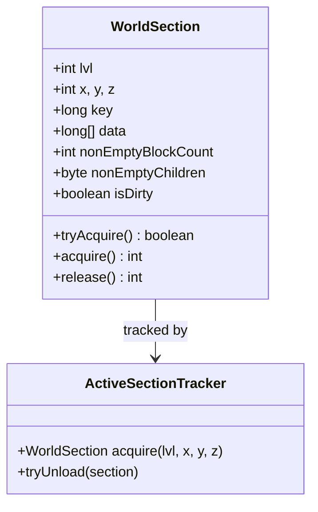
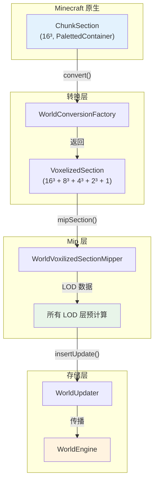

> 本章基于 Voxy 源码分析，深入讲解世界引擎的核心组件与工作原理。

## 目录

- [WorldSection：32³ 数据容器](#worldsection32³-数据容器)
- [WorldEngine：世界引擎核心](#worldengine世界引擎核心)
- [从 ChunkSection 到 VoxelizedSection](#从-chunksection-到-voxelizedsection)
- [WorldEngine Tick 逻辑](#worldengine-tick-逻辑)
- [课后自查](#课后自查)

---

## WorldSection：32³ 数据容器

### 什么是 WorldSection？

`WorldSection` 是 Voxy 世界数据的基本存储单元，每个 section 覆盖 **32×32×32 = 32,768** 个体素。



### 数据编码格式

每个体素用 **37 bits** 编码，存储在一个 `long[] data` 数组中：

```
┌──────────────────────────────────────────────────────────────────┐
│ 63-56 (8 bits)  │  55-47 (9 bits)  │  46-27 (20 bits)  │ 26-0    │
├──────────────────┼──────────────────┼───────────────────┼─────────┤
│ light            │ biome            │ block             │ unused  │
│ 亮度 (0-255)     │ 生物群系 (0-511) │ 方块状态 (100万+) │         │
└──────────────────────────────────────────────────────────────────┘
```

- **light (8 bits)**：光照等级，包括方块光和天空光
- **biome (9 bits)**：生物群系 ID，支持 512 种生物群系
- **block (20 bits)**：方块状态 ID，支持约 100 万种方块状态

### 引用计数机制

```java
public final class WorldSection {
    // 原子状态：最低位=加载标志，其余位=引用计数
    private static final VarHandle ATOMIC_STATE_HANDLE;

    public boolean tryAcquire() {
        int prev, next;
        do {
            prev = (int) ATOMIC_STATE_HANDLE.get(this);
            if ((prev & 1) == 0) {
                // 已释放，直接返回
                return false;
            }
            next = prev + 2; // 引用计数 +2
        } while (!ATOMIC_STATE_HANDLE.compareAndSet(this, prev, next));
        return (next & 1) != 0;
    }
}
```

**设计要点：**

| 位 | 含义 |
|----|------|
| bit 0 | 加载标志：0=已释放，1=已加载 |
| bits 1+ | 引用计数：每次 acquire +2，每次 release -2 |

### 数组复用缓存

为了减少 GC 压力，`WorldSection` 复用 `long[]` 数组而非每次新建：

```java
private static final int ARRAY_REUSE_CACHE_SIZE = 400;
private static final ConcurrentLinkedDeque<long[]> ARRAY_REUSE_CACHE = new ConcurrentLinkedDeque<>();
```

---

## WorldEngine：世界引擎核心

### WorldEngine 是什么？

`WorldEngine` 是管理世界数据的主类，协调 **LOD 层**、**Section 追踪器** 和 **持久化存储**。

```java
public class WorldEngine {
    public static final int MAX_LOD_LAYER = 4;

    private final Mapper mapper;
    private final ActiveSectionTracker sectionTracker;
    private final SectionStorage storage;
    // ...
}
```

### Section ID 编码

WorldEngine 使用 **64 位 long** 编码位置信息：

```java
public static long getWorldSectionId(int lvl, int x, int y, int z) {
    return ((long)lvl << 60) |
           ((long)(y & 0xFF) << 52) |
           ((long)(z & ((1 << 24) - 1)) << 28) |
           ((long)(x & ((1 << 24) - 1)) << 4);
}
```

64-bit Section ID 布局：

```
┌────────┬────────┬─────────────────────┬─────────────────────┬──────┐
│ 4 bits │ 8 bits │      24 bits        │      24 bits         │ 4bit │
│  lvl   │   Y    │         Z           │         X           │ spare│
│  60-63 │ 52-59  │      28-51          │      4-27           │ 0-3  │
└────────┴────────┴─────────────────────┴─────────────────────┴──────┘
```

### LOD 层级映射

| Level | Section 大小 | 覆盖体素数 | 用途 |
|-------|-------------|-----------|------|
| L0 | 32³ | 32³ | 最高细节，近距离 |
| L1 | 32³ | 64³ | 1:8 压缩 |
| L2 | 32³ | 128³ | 1:64 压缩 |
| L3 | 32³ | 256³ | 1:512 压缩 |
| L4 | 32³ | 512³ | 最低细节，远距离 |

每个 LOD 层的一个 section 覆盖 **2^(lvl+1)** 个 Level 0 sections。

---

## 从 ChunkSection 到 VoxelizedSection

### 转换流程图



### VoxelizedSection 结构

```java
public class VoxelizedSection {
    public int x, y, z;
    public int lvl0NonAirCount;
    public final long[] section;  // 4913 longs = 16³ + 8³ + 4³ + 2³ + 1
}
```

**4913 longs 的组成：**

```
┌────────────────────────────────────────────┐
│  Level 0: 16³ = 4096 longs    [偏移 0]    │
│  Level 1: 8³  = 512  longs   [偏移 4096]  │
│  Level 2: 4³  = 64   longs   [偏移 4608]  │
│  Level 3: 2³  = 8    longs   [偏移 4672]  │
│  Level 4: 1³  = 1    long    [偏移 4680]  │
├────────────────────────────────────────────┤
│  Total: 4681 longs ≈ 37 KB                │
└────────────────────────────────────────────┘
```

---

## WorldEngine Tick 逻辑

### 简化版 Tick 流程

```java
public class WorldEngine {
    private final ActiveSectionTracker sectionTracker;
    private final Mapper mapper;

    public void tick() {
        // 1. 处理待处理的 chunk 更新
        processPendingChunks();

        // 2. 更新所有 LOD 层
        for (int lvl = 0; lvl <= MAX_LOD_LAYER; lvl++) {
            updateLodLayer(lvl);
        }

        // 3. 清理空闲 sections
        sectionTracker.cleanupIdle();
    }

    private void processPendingChunks() {
        // 从 Minecraft 接收新的 ChunkSection
        ChunkSection mcSection = pendingChunks.take();

        // 转换为 Voxy 格式
        VoxelizedSection voxySection = WorldConversionFactory.convert(
            voxySection,       // 可复用的 buffer
            mapper,
            mcSection.getBlockData(),
            mcSection.getBiomeData(),
            mcSection.getLightSupplier()
        );

        // 预计算所有 LOD 层
        WorldVoxilizedSectionMipper.mipSection(voxySection, mapper);

        // 插入到世界引擎
        WorldUpdater.insertUpdate(this, voxySection);
    }

    private void updateLodLayer(int lvl) {
        // 获取当前需要渲染的视图范围
        int viewDistance = getViewDistance(lvl);

        // 加载范围内的 sections
        for (int cx = -viewDistance; cx <= viewDistance; cx++) {
            for (int cz = -viewDistance; cz <= viewDistance; cz++) {
                // 计算该 LOD 层对应的 section 坐标
                int sx = cx >> (lvl + 1);
                int sz = cz >> (lvl + 1);

                // 确保 section 已加载
                sectionTracker.acquire(lvl, sx, 0, sz);
            }
        }

        // 卸载范围外的 sections
        sectionTracker.unloadDistant(viewDistance);
    }
}
```

### LOD 层切换逻辑

```java
public static int selectLodLevel(int renderDistance, int blockX, int blockZ, int cameraX, int cameraZ) {
    int dx = blockX - cameraX;
    int dz = blockZ - cameraZ;
    int dist = Math.max(Math.abs(dx), Math.abs(dz));

    // 根据距离选择 LOD 层
    if (dist < 32)  return 0;  // 32 blocks
    if (dist < 64)  return 1;  // 64 blocks
    if (dist < 128) return 2;  // 128 blocks
    if (dist < 256) return 3;  // 256 blocks
    return 4;                   // 512 blocks (最大)
}
```

### WorldUpdater 更新传播

```java
public static void insertUpdate(WorldEngine into, VoxelizedSection section) {
    for (int lvl = 0; lvl <= MAX_LOD_LAYER; lvl++) {
        // 计算该 LOD 层对应的 section 坐标
        int sx = section.x >> (lvl + 1);
        int sy = section.y >> (lvl + 1);
        int sz = section.z >> (lvl + 1);

        // 获取或创建 section
        WorldSection worldSection = into.acquire(lvl, sx, sy, sz);

        // 更新数据
        updateSectionData(worldSection, section, lvl);

        // 检查是否需要向上传播
        if (hasSignificantChange(worldSection)) {
            continue; // 传播到更高层
        }
    }
}
```

---

## 课后自查

✅ **学完本章后，你能回答这些问题吗？**

1. **WorldSection 的 `long[] data` 每个条目如何编码？** 37 bits 分别代表什么？

2. **引用计数机制如何工作？** 为什么最低位是加载标志位？

3. **WorldEngine 如何用 64 位 long 编码 Section ID？** 每段占多少位？

4. **VoxelizedSection 的 4913 longs 如何分配给 5 个 LOD 层？**

5. **为什么需要从 ChunkSection (16³) 转换到 VoxelizedSection？** 转换带来了什么优势？

6. **WorldUpdater 的 `insertUpdate()` 为什么要循环遍历所有 LOD 层？**

---

## 参考资料

- 官方仓库：[voxy](https://github.com/comp500/voxy)
- 源码文件：
  - `WorldSection.java`: `D:\Minecraft-Learning\assets\voxy\src\main\java\me\cortex\voxy\common\world\WorldSection.java`
  - `WorldEngine.java`: `D:\Minecraft-Learning\assets\voxy\src\main\java\me\cortex\voxy\common\world\WorldEngine.java`
  - `VoxyInstance.java`: `D:\Minecraft-Learning\assets\voxy\src\main\java\me\cortex\voxy\commonImpl\VoxyInstance.java`
- 分析文档：`content/voxy/1.21.11-fabric-0.2.13-alpha/analysis/02-world-engine.md`
