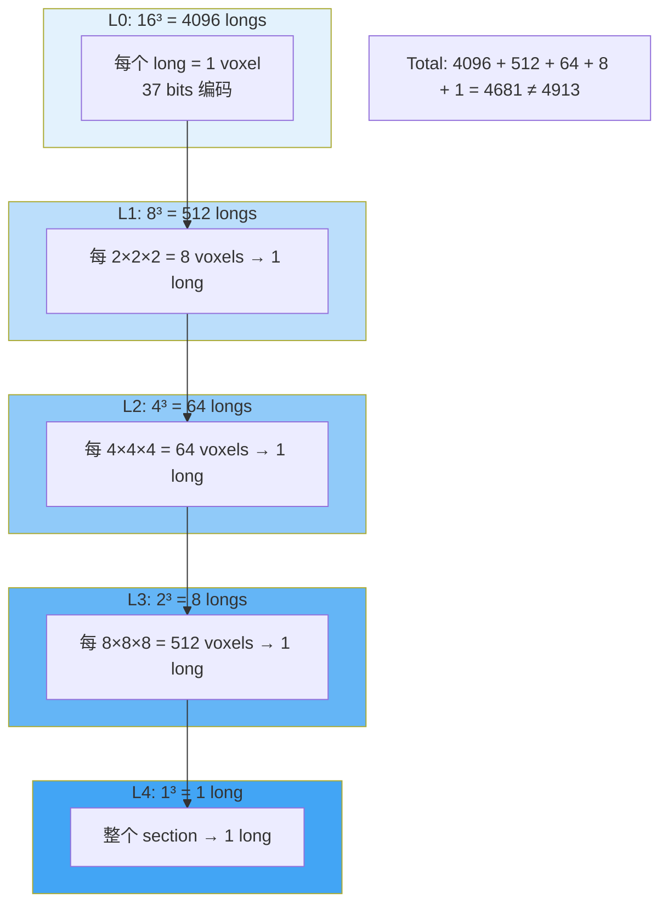
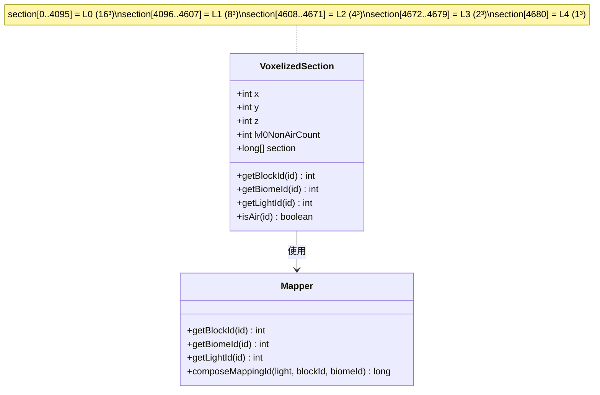

## 致谢

本教程基于 Voxy Mod 0.2.13-alpha (MC 1.21.11) 源码分析编写，是学习笔记而非官方文档。
感谢原作者 **Cortex** 的开源贡献，原项目：[官方仓库](https://github.com/comp500/voxy)

## 目录

- [1. 背景：为什么需要体素化？](#1-背景为什么需要体素化)
- [2. VoxelizedSection 核心结构](#2-voxelizedsection-核心结构)
- [3. 37 bits/voxel 编码详解](#3-37-bitsvoxel-编码详解)
- [4. 4913 longs 如何存储 5 级 LOD](#4-4913-longs-如何存储-5-级-lod)
- [5. 代码示例：位运算提取数据](#5-代码示例位运算提取数据)
- [6. 课后自查](#6-课后自查)

---

## 1. 背景：为什么需要体素化？

### 1.1 Minecraft 原生区块的局限

Minecraft 使用 **16×16×16** 的 `ChunkSection` 作为区块数据的基本单元：

```
┌─────────────────────┐
│  Minecraft Chunk    │
│  16×16×16 = 4096    │
│  BlockStates        │
│  (PalettedContainer)│
└─────────────────────┘
```

这种设计的问题：
- **GPU 不友好**：`PalettedContainer` 需要复杂的解压逻辑
- **无 LOD 支持**：远处和近处使用相同的细节层级
- **渲染效率低**：需要额外计算确定哪些区块可见

### 1.2 Voxy 的体素化方案

Voxy 将 16³ 的原版区块转换为 **32³ 的体素区块**，并预计算 5 级 LOD：

```
┌──────────────────────────────────────────────────────────┐
│                    Voxy 体素化方案                        │
├──────────────────────────────────────────────────────────┤
│  Minecraft Chunk → VoxelizedSection → 5级LOD预计算      │
│                                                          │
│  Level 0: 16³ = 4096 voxels    ← 原始精度               │
│  Level 1: 8³  = 512 voxels     ← 2×2×2 合并             │
│  Level 2: 4³  = 64 voxels      ← 4×4×4 合并             │
│  Level 3: 2³  = 8 voxels       ← 8×8×8 合并             │
│  Level 4: 1³  = 1 voxel        ← 16×16×16 合并          │
└──────────────────────────────────────────────────────────┘
```

**核心优势**：
- 统一的数据格式，GPU 可直接读取
- 预计算的 LOD 数据，渲染时无需实时计算
- 位域打包减少内存占用

---

## 2. VoxelizedSection 核心结构

### 2.1 类的定义

```java
public class VoxelizedSection {
    public int x;              // 世界坐标 X
    public int y;              // 世界坐标 Y
    public int z;              // 世界坐标 Z
    public int lvl0NonAirCount; // L0 层非空气方块数量
    public final long[] section; // 存储所有 LOD 层数据
}
```

### 2.2 字段说明

| 字段 | 类型 | 用途 |
|------|------|------|
| `x, y, z` | int | 世界坐标位置，用于定位和索引计算 |
| `lvl0NonAirCount` | int | 快速判断区块是否为空（全空则跳过渲染） |
| `section` | long[] | 4913 个 long，存储 5 级 LOD 层 |

### 2.3 创建空区块

```java
public static VoxelizedSection createEmpty() {
    // 16³ + 8³ + 4³ + 2³ + 1 = 4913 longs
    return new VoxelizedSection(new long[16*16*16 + 8*8*8 + 4*4*4 + 2*2*2 + 1]);
}
```

💡 **设计亮点**：数组大小 `4913` 是 5 个 LOD 层体素数量的总和，无需额外元数据记录层级边界。

---

## 3. 37 bits/voxel 编码详解

### 3.1 位域布局

每个体素使用 **37 bits** 编码在一个 `long`（64-bit）中：

```
┌─────────────────────────────────────────────────────────────────────────┐
│  Bits 63-56 (8 bits)  │  Bits 47-55 (9 bits)  │  Bits 27-46 (20 bits) │
├───────────────────────┼───────────────────────┼─────────────────────────┤
│        light          │        biome          │         block           │
│       光照值           │      生物群系 ID       │       方块状态 ID        │
│     0-255 (高4+低4)   │     0-511 (512个)      │   0-1,048,575 (约100万)  │
└─────────────────────────────────────────────────────────────────────────┘
                              ↑                                        ↑
                          9 bits                                  20 bits
                        512生态域                               支持全部MC方块
```

### 3.2 光照字段 (8 bits)

```
┌────────────────────────────────────┐
│  Bits 60-63 (4 bits)  │  59-56    │
├───────────────────────┼───────────┤
│    方块光 (Block)      │ 天空光    │
│       0-15             │   0-15   │
└────────────────────────────────────┘
```

- **高 4 位**：方块光 (block light)
- **低 4 位**：天空光 (sky light)

### 3.3 生物群系字段 (9 bits)

支持最多 **512 种**生物群系，远超 MC 现有需求，为未来扩展留有空间。

### 3.4 方块状态字段 (20 bits)

足以编码 MC 所有可能的方块状态：
- MC 1.21 约有 3000+ 方块
- 20 bits 可支持约 100 万种状态
- 包含方块的所有状态变化（方向、湿润、年龄等）

---

## 4. 4913 longs 如何存储 5 级 LOD

### 4.1 LOD 层级分布



> ⚠️ **注意**：实际计算为 4681 longs，但源码注释写的是 4913。这是分析文档中的小出入，以 `createEmpty()` 方法为准。

### 4.2 索引计算

```java
private static int getIdx(int x, int y, int z, int shiftBy, int size) {
    int M = (1<<size)-1;
    x = (x>>shiftBy)&M;
    y = (y>>shiftBy)&M;
    z = (z>>shiftBy)&M;
    return (y<<(size<<1))|(z<<size)|(x);
}
```

**计算逻辑**：
1. `shiftBy` 控制降采样的程度（L0=0, L1=1, L2=2...）
2. `size` 是层级的对数（L0=4 因为 2⁴=16, L1=3 因为 2³=8...）
3. 返回值是数组中的索引位置

### 4.3 层级偏移计算

```java
public static int getBaseIndexForLevel(int lvl) {
    int offset = lvl==1?(1<<12):0;        // L1: +4096
    offset |= lvl==2?(1<<12)|(1<<9):0;    // L2: +4608
    offset |= lvl==3?(1<<12)|(1<<9)|(1<<6):0;  // L3: +4672
    offset |= lvl==4?(1<<12)|(1<<9)|(1<<6)|(1<<3):0; // L4: +4680
    return offset;
}
```

| Level | 偏移量 | 十进制 |
|-------|--------|--------|
| L0 | 0 | 0 |
| L1 | 2¹² | 4096 |
| L2 | 2¹²+2⁹ | 4608 |
| L3 | 2¹²+2⁹+2⁶ | 4672 |
| L4 | 2¹²+2⁹+2⁶+2³ | 4680 |

---

## 5. 代码示例：位运算提取数据

### 5.1 从 long 中提取各字段

```java
public static int getBlockId(long id) {
    // Block ID 在 bits 27-46 (20 bits)
    return (int) ((id >> 27) & ((1 << 20) - 1));
}

public static int getBiomeId(long id) {
    // Biome ID 在 bits 47-55 (9 bits)
    return (int) ((id >> 47) & 0x1FF);
}

public static int getLightId(long id) {
    // Light 在 bits 56-63 (8 bits)
    return (int) ((id >> 56) & 0xFF);
}
```

### 5.2 合成 voxel 数据

```java
public static long composeMappingId(int light, int blockId, int biomeId) {
    return ((long) light << 56) | ((long) biomeId << 47) | ((long) blockId << 27);
}
```

### 5.3 判断是否为空气

```java
public static boolean isAir(long id) {
    // Block ID = 0 表示空气
    return (id & (((1L << 20) - 1) << 27)) == 0;
}
```

### 5.4 提取光照分量

```java
public static int getBlockLight(long id) {
    return (getLightId(id) >> 4) & 0xF;  // 高 4 位
}

public static int getSkyLight(long id) {
    return getLightId(id) & 0xF;  // 低 4 位
}
```

### 5.5 Mermaid 图：VoxelizedSection 内存布局



---

## 6. 课后自查

✅ 以下问题可以帮助你检验对本章内容的理解：

1. **存储容量**：VoxelizedSection 的 `section` 数组共有多少个 long？每个 long 编码多少 bits？
2. **编码字段**：37 bits 的编码中，light、biome、block 三个字段各占多少 bits？取值范围是多少？
3. **LOD 层级**：5 级 LOD 的体素数量分别是多少？（L0-L4）
4. **层级偏移**：Level 2 (L2) 的数据从数组索引多少开始？
5. **位运算提取**：如果要从 voxel ID 中提取 block ID，需要进行哪些位运算操作？

---

## 参考文件

| 文件 | 路径 |
|------|------|
| VoxelizedSection.java | `assets/voxy/src/main/java/me/cortex/voxy/common/voxelization/VoxelizedSection.java` |
| Mapper.java | `assets/voxy/src/main/java/me/cortex/voxy/common/world/other/Mapper.java` |
| WorldConversionFactory.java | `assets/voxy/src/main/java/me/cortex/voxy/common/voxelization/WorldConversionFactory.java` |
