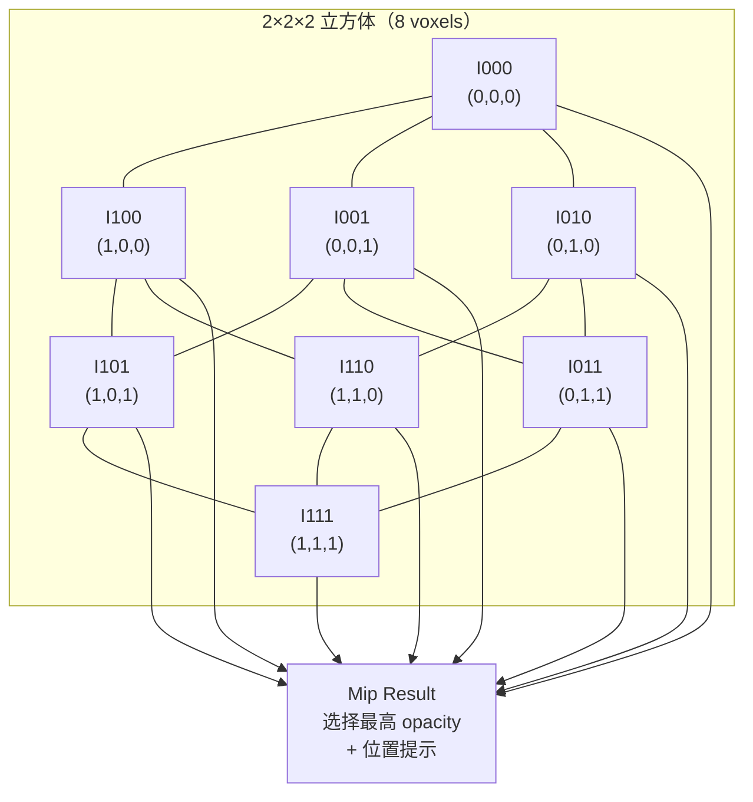
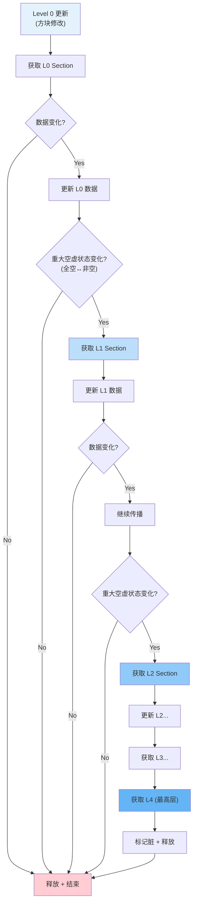
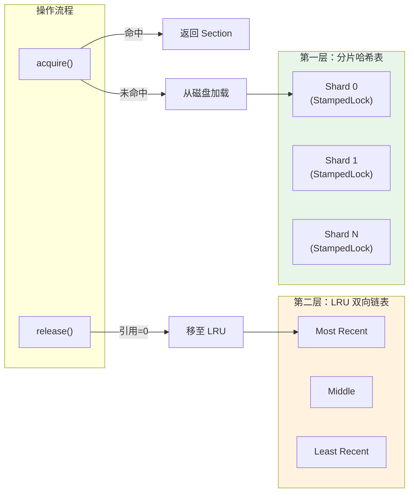

## 致谢

本教程基于 Voxy Mod 0.2.13-alpha (MC 1.21.11) 源码分析编写，是学习笔记而非官方文档。
感谢原作者 **Cortex** 的开源贡献，原项目：[官方仓库](https://github.com/comp500/voxy)

## 目录

- [1. LOD 系统概述](#1-lod-系统概述)
- [2. 5 级 LOD 层级生成算法](#2-5-级-lod-层级生成算法)
- [3. WorldUpdater 向上传播更新](#3-worldupdater-向上传播更新)
- [4. Section ID 64-bit 布局解析](#4-section-id-64-bit-布局解析)
- [5. 双层 LRU 缓存设计](#5-双层-lru-缓存设计)
- [6. 课后自查](#6-课后自查)

---

## 1. LOD 系统概述

### 1.1 什么是 LOD？

**LOD (Level of Detail)** 即多细节层级，是一种优化渲染性能的技术。核心思想是：

```
近距离 → 高细节（看到单个方块）
远距离 → 低细节（看到地形轮廓即可）
```

### 1.2 Voxy 的 5 级 LOD

| Level | Section 大小 | 实际覆盖范围 | 压缩比 | 典型用途 |
|-------|-------------|-------------|--------|----------|
| L0 | 32³ voxels | 32³ blocks | 1:1 | 0-32 区块 |
| L1 | 32³ voxels | 64³ blocks | 1:8 | 32-64 区块 |
| L2 | 32³ voxels | 128³ blocks | 1:64 | 64-128 区块 |
| L3 | 32³ voxels | 256³ blocks | 1:512 | 128-256 区块 |
| L4 | 32³ voxels | 512³ blocks | 1:4096 | 远距离地平线 |

### 1.3 LOD 的优势

- **内存节省**：远距离使用压缩数据，减少显存占用
- **渲染加速**：减少需要处理的顶点和面片数量
- **预计算**：数据在导入时已计算完毕，渲染时无需额外计算

---

## 2. 5 级 LOD 层级生成算法

### 2.1 Mipper 合并规则

Mipper 是 LOD 生成的核心算法，负责将 **8 个子体素合并为 1 个父体素**：

```java
public static long mip(long I000, long I100, long I001, long I101,
                       long I010, long I110, long I011, long I111,
                       Mapper mapper) {
    int max = -1;
    
    // 8 个输入对应 2×2×2 立方体的 8 个角点
    // 选择不透明度最高的非空气方块
    
    if (!Mapper.isAir(I111)) {
        max = (mapper.getBlockStateOpacity(I111) << 4) | 0b111;
    }
    if (!Mapper.isAir(I110)) {
        max = Math.max((mapper.getBlockStateOpacity(I110) << 4) | 0b110, max);
    }
    // ... 处理其余 6 个角点 ...
    
    if (max != -1) {
        return switch (max & 0b111) {
            case 0 -> I000;
            case 1 -> I001;
            // ... 返回选中的 voxel
        };
    } else {
        // 全是空气：平均光照
        int blockLight = ...;
        int skyLight = ...;
        return withLight(I111, (blockLight / 8) << 4 | (skyLight / 8));
    }
}
```

### 2.2 2×2×2 合并示意



### 2.3 合并策略

1. **优先非空气**：只要有非空气方块，就选择它
2. **基于不透明度**：使用 `BlockState.getOpacity()` 评估遮蔽程度
3. **角点位优先级**：当不透明度相同时，选择较高/较远的角点
4. **光照平均**：8 个全为空气时，对光照取平均

### 2.4 降采样层级索引

```java
// L0 索引计算
private static int G(int x, int y, int z) {
    return ((y << 8) | (z << 4) | x);  // 16×16 网格
}

// L1 索引计算（偏移 16³ = 4096）
private static int H(int x, int y, int z) {
    return ((y << 6) | (z << 3) | x) + 16*16*16;
}

// L2 索引计算（偏移 16³ + 8³ = 4608）
private static int I(int x, int y, int z) {
    return ((y << 4) | (z << 2) | x) + 8*8*8 + 16*16*16;
}

// L3 索引计算（偏移 16³ + 8³ + 4³ = 4672）
private static int J(int x, int y, int z) {
    return ((y << 2) | (z << 1) | x) + 4*4*4 + 8*8*8 + 16*16*16;
}
```

---

## 3. WorldUpdater 向上传播更新

### 3.1 传播机制

当 Level 0 的数据发生变化时，需要**向上更新所有父级 LOD 层**：

```java
public static void insertUpdate(WorldEngine into, VoxelizedSection section) {
    for (int lvl = 0; lvl <= MAX_LOD_LAYER; lvl++) {
        // 计算每个层级的 section 坐标
        var worldSection = into.acquire(
            lvl,
            section.x >> (lvl + 1),
            section.y >> (lvl + 1),
            section.z >> (lvl + 1)
        );
        
        // 更新该层的数据
        // ...
        
        // 检测是否需要向上传播
        if (shouldPropagate) {
            continue; // 继续到下一层
        } else {
            break; // 停止传播
        }
    }
}
```

### 3.2 坐标转换公式

```java
// 计算在父级 section 中的相对偏移
final int msk = (1 << (lvl + 1)) - 1;
final int bx = (section.x & msk) << (4 - lvl);
final int by = (section.y & msk) << (4 - lvl);
final int bz = (section.z & msk) << (4 - lvl);
```

### 3.3 Mermaid 图：LOD 更新传播流程



### 3.4 传播终止条件

LOD 传播在以下情况终止：

1. **无数据变化**：当前层数据未改变，无需更新父层
2. **已达最高层**：L4 是最大层级，无法继续向上
3. **父级未变化**：即使子级变化，若父级整体不受影响，可提前终止

---

## 4. Section ID 64-bit 布局解析

### 4.1 位域结构

```java
public static long getWorldSectionId(int lvl, int x, int y, int z) {
    return ((long) lvl << 60) |
           ((long) (y & 0xFF) << 52) |
           ((long) (z & ((1 << 24) - 1)) << 28) |
           ((long) (x & ((1 << 24) - 1)) << 4);
}
```

### 4.2 位域图示

```
┌─────────────────────────────────────────────────────────────────────────┐
│  63-60 (4 bits)  │  59-52 (8 bits)  │  51-28 (24 bits) │  27-4 (24 bits)│
├───────────────────┼──────────────────┼───────────────────┼──────────────┤
│       lvl         │        y         │        z          │      x       │
│     LOD 层级       │    Y 坐标        │     Z 坐标         │     X 坐标    │
│     0-15          │    0-255         │    0-16M          │   0-16M      │
└─────────────────────────────────────────────────────────────────────────┘
         ↑                                      
    (4 bits spare)                         
```

### 4.3 字段详解

| 字段 | 位范围 | 长度 | 取值范围 | 说明 |
|------|--------|------|----------|------|
| `lvl` | 60-63 | 4 bits | 0-15 | LOD 层级（实际只用 0-4） |
| `y` | 52-59 | 8 bits | 0-255 | Y 坐标（MC 高度限制 0-383，但只存 8 位） |
| `z` | 28-51 | 24 bits | 0-16M | Z 坐标（世界边界内） |
| `x` | 4-27 | 24 bits | 0-16M | X 坐标（世界边界内） |
| 预留 | 0-3 | 4 bits | - | 预留扩展 |

### 4.4 提取字段

```java
public static int getLvlFromKey(long key) {
    return (int) (key >> 60);
}

public static int getYFromKey(long key) {
    return (int) ((key >> 52) & 0xFF);
}

public static int getZFromKey(long key) {
    return (int) ((key >> 28) & 0xFFFFFF);
}

public static int getXFromKey(long key) {
    return (int) ((key >> 4) & 0xFFFFFF);
}
```

---

## 5. 双层 LRU 缓存设计

### 5.1 缓存架构概述



### 5.2 第一层：分片哈希表

```java
private final Long2ObjectOpenHashMap<VolatileHolder<WorldSection>>[] loadedSectionCache;
private final StampedLock[] locks;

// 默认 64 个分片
private static final int DEFAULT_CACHE_SHARD_COUNT = 64;
```

**设计优势**：
- 减少锁竞争：不同分片可并行访问
- `StampedLock`：读多写少场景下的高效锁

### 5.3 第二层：LRU 双向链表

```java
private final Long2ObjectLinkedOpenHashMap<WorldSection> lruSecondaryCache;
private final StampedLock lruLock;
```

**作用**：
- 保存已卸载但保留数据的 sections
- 复用 `long[]` 数组，避免频繁 GC
- 最近访问的排在链表头部

### 5.4 获取 Section (acquire)

```java
public WorldSection acquire(long key, boolean nullOnEmpty) {
    int index = getCacheArrayIndex(key);
    var cache = loadedSectionCache[index];
    var lock = locks[index];
    
    // 尝试读锁
    long stamp = lock.readLock();
    holder = cache.get(key);
    if (holder != null && holder.obj != null) {
        holder.obj.acquire();
        lock.unlockRead(stamp);
        return holder.obj;
    }
    lock.unlockRead(stamp);
    
    // 未命中：从磁盘或二级缓存加载
    // ...
}
```

### 5.5 释放 Section (release)

```java
public void release(WorldSection section, boolean nullOnEmpty) {
    if (section.release() != 0) {
        return; // 仍有引用
    }
    
    if (section.isDirty) {
        engine.saveSection(section); // 持久化脏数据
    }
    
    // 从主缓存移除，添加到 LRU 链表
    removeFromPrimaryCache(section);
    addToSecondaryLRU(section);
}
```

### 5.6 缓存容量配置

```java
private static final int ARRAY_REUSE_CACHE_SIZE = 400;
private static final AtomicInteger ARRAY_REUSE_CACHE_COUNT = new AtomicInteger(0);
private static final ConcurrentLinkedDeque<long[]> ARRAY_REUSE_CACHE = new ConcurrentLinkedDeque<>();
```

LRU 缓存满时，最旧的 `long[]` 数组被回收复用，减少 GC 压力。

---

## 6. 课后自查

✅ 以下问题可以帮助你检验对本章内容的理解：

1. **LOD 层级**：Voxy 有几级 LOD？L4 层一个 Section 覆盖多少原版 chunk？
2. **Mipper 算法**：2×2×2 合并时，如果 8 个体素都是非空气方块，Mipper 如何选择保留哪一个？
3. **传播机制**：WorldUpdater 在什么情况下会停止向上传播 LOD 更新？
4. **Section ID**：如果一个 Section ID 的 `lvl=2, x=1000, y=64, z=2000`，请计算其在 64-bit 中的十六进制值。
5. **双层缓存**：ActiveSectionTracker 的两级缓存分别是什么？各有何作用？
6. **数组复用**：为什么要有 `ARRAY_REUSE_CACHE`？它解决了什么问题？

---

## 参考文件

| 文件 | 路径 |
|------|------|
| WorldUpdater.java | `assets/voxy/src/main/java/me/cortex/voxy/common/world/WorldUpdater.java` |
| ActiveSectionTracker.java | `assets/voxy/src/main/java/me/cortex/voxy/common/world/ActiveSectionTracker.java` |
| WorldEngine.java | `assets/voxy/src/main/java/me/cortex/voxy/common/world/WorldEngine.java` |
| WorldSection.java | `assets/voxy/src/main/java/me/cortex/voxy/common/world/WorldSection.java` |
| Mipper.java | `assets/voxy/src/main/java/me/cortex/voxy/common/world/other/Mipper.java` |
