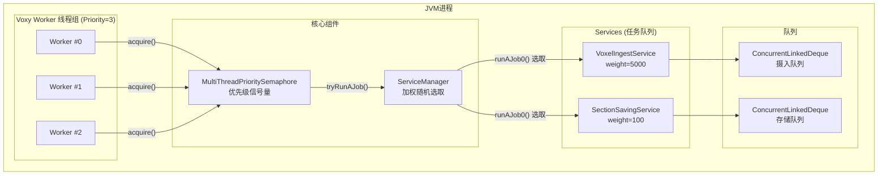

## 致谢

本教程基于 Cortextea (The True Cortex) 的开源项目 Voxy 编写。感谢原作者的开源贡献，使得学习这套精密的异步任务调度系统成为可能。

- 官方仓库：[comp500/voxy](https://github.com/comp500/voxy)
- 本笔记仅为学习记录，代码版权归属原作者

---

## 目录

- [1. 为什么要用专用线程池？](#1-为什么要用专用线程池)
- [2. 线程模型总览](#2-线程模型总览)
- [3. 3 个 Worker 线程的角色分工](#3-3-个-worker-线程的角色分工)
- [4. ServiceManager 加权随机选取算法](#4-servicemanager-加权随机选取算法)
- [5. Service 返回值语义](#5-service-返回值语义)
- [6. VoxelIngestService vs SectionSavingService](#6-voxelingestservice-vs-sectionsavingservice)
- [7. 代码示例：加权随机选取算法简化实现](#7-代码示例加权随机选取算法简化实现)
- [8. 课后自查](#8-课后自查)

---

## 1. 为什么要用专用线程池？

Minecraft 的主线程负责处理游戏逻辑、渲染、物理模拟等大量工作。当 Voxy 需要处理体素化、存储等耗时操作时，如果在主线程执行会造成**帧率暴跌、画面卡顿**。

Voxy 的解决方案是：**创建专用 Worker 线程池**，将所有耗时操作异步化。

| 对比维度 | 主线程处理 | 专用线程池处理 |
|---------|-----------|---------------|
| 帧率影响 | 直接卡顿 | 完全独立 |
| 并发能力 | 单线程串行 | 多线程并行 |
| 响应延迟 | 高（需等待完成） | 低（异步提交即可） |
| 复杂度 | 简单 | 需要协调同步 |

💡 **关键设计**：这 3 个 Worker 线程**不参与游戏逻辑**，只专注处理 Voxy 的体素化和存储任务。

---

## 2. 线程模型总览



### 关键组件

| 组件 | 职责 |
|------|------|
| `UnifiedServiceThreadPool` | 管理 Worker 线程生命周期 |
| `ServiceManager` | 调度任务，决定哪个 Service 执行 |
| `MultiThreadPrioritySemaphore` | 协调 Worker 阻塞/唤醒 |
| `Service` | 任务队列抽象，惰性执行 |

---

## 3. 3 个 Worker 线程的角色分工

### 3.1 线程创建

源码路径：`D:\Minecraft-Learning\assets\voxy\src\main\java\me\cortex\voxy\common\thread\UnifiedServiceThreadPool.java`

```java
var t = new Thread(this.dedicatedPool, this::workerThread, "Dedicated Voxy Worker #" + (this.threadId++));
t.setPriority(3);      // 低优先级
t.setDaemon(true);     // JVM 退出时自动销毁
this.threads.add(t);
t.start();
```

### 3.2 优先级 3 的设计意图

Java 线程优先级范围是 `Thread.MIN_PRIORITY`(1) 到 `Thread.MAX_PRIORITY`(10)，默认是 `NORM_PRIORITY`(5)。

**设为 3 的原因**：

1. **低于正常优先级**：让 Voxy Worker 不会过度抢占渲染线程/主线程的时间片
2. **不影响帧率**：大量任务堆积时不会拖慢游戏
3. **专为 I/O 优化**：存储操作优先级低，可随时被渲染让路

### 3.3 动态扩缩容

```java
public boolean setNumThreads(int threads) {
    int diff = threads - this.threads.size();
    if (diff < 0) {
        this.selfBlock.release(-diff);  // 释放许可证，线程自然退出
    } else {
        for (int i = 0; i < diff; i++) {
            // 创建新线程...
        }
    }
}
```

💡 **优雅退出**：不直接 kill 线程，而是释放许可证让 Worker 的 `acquire()` 返回后自然退出，避免半完成状态。

---

## 4. ServiceManager 加权随机选取算法

### 4.1 核心思想

当多个 Service 都有任务时，`ServiceManager.runAJob0()` 使用**加权随机选取**算法决定执行哪个。

选取概率 = `Service 任务数 × weight / 所有 Service 总权重`

### 4.2 shiftFactor 技巧

为了避免低权重 Service 被饿死，每次轮转通过 `shiftFactor` 改变起始位置：

```java
int shiftFactor = (ctx.shiftFactor++) & Integer.MAX_VALUE;
```

这样第 N 次调用会从 `(N % services.length)` 位置开始遍历，确保公平性。

### 4.3 算法流程

```mermaid
flowchart TD
    A["start: runAJob0()"] --> B["计算 totalWeight\n遍历所有 Service"]
    B --> C{"totalWeight == 0?"}
    C -->|"是": D["return 2 (队列空)\nor 3 (被 limiter 跳过)"]
    C -->|"否": E["sample = rand(totalWeight)\n随机采样点"]
    E --> F["遍历 services\nsample -= numJobs × weight"]
    F --> G{"sample <= 0?"}
    G -->|"是": H["selectedService = service\nbreak"]
    G -->|"否": F
    F --> I{"遍历完?"}
    I -->|"是": J["return 2"]
    H --> K["selectedService.runJob()"]
    K --> L["return 0 (成功)"]
```

---

## 5. Service 返回值语义

`ServiceManager.tryRunAJob()` 返回值含义：

| 返回值 | 含义 | 后续动作 |
|-------|------|---------|
| `0` | 成功执行一个任务 | 正常退出 |
| `1` | 无任务或无 Service | 正常退出 |
| `2` | 所有 Service 队列为空 | 正常退出 |
| `3` | 部分 Service 被 limiter 跳过但可能有任务 | 等待后重试 |

### MultiThreadPrioritySemaphore 的处理

```java
int status = this.executor.getAsInt();
if (status == 0) return false;   // 任务成功执行
if (status == 1) return false;   // 无任务或无 Service
if (2 <= status) {                // 2/3: 找到服务但无法运行
    if (block.localSemaphore.tryAcquire(10, TimeUnit.MILLISECONDS)) {
        block.blockSemaphore.tryAcquire();
        this.pooledRelease(1);   // 归还许可证
        return true;
    }
}
```

---

## 6. VoxelIngestService vs SectionSavingService

| 对比维度 | VoxelIngestService | SectionSavingService |
|---------|-------------------|---------------------|
| **权重 (weight)** | 5000 | 100 |
| **任务类型** | 体素化摄入 | 持久化存储 |
| **队列上限** | 无硬限制 | 软上限 5000，硬上限 1200 |
| **limiter** | `null` (不限流) | `() -> taskCount < 1200` |
| **阻塞策略** | 纯异步 | 超过软上限时主线程同步处理 |
| **优先级** | 极高 | 较低 |

### 权重差异的影响

权重比 5000:100 = 50:1，意味着：
- 同样有 10 个任务时，VoxelIngestService 被选中的概率是 SectionSavingService 的 50 倍
- **区块加载优先于存储**：玩家不会因为存储慢而看到黑块

### SectionSavingService 的双层限流

```java
// 第一层：软上限 5000
if (getTaskCount() > 5000 && !nonBlocking) {
    service.steal();  // 主线程同步处理
}

// 第二层：硬上限 1200 (通过 limiter)
limiter = () -> savingService.getTaskCount() < 1200;
```

---

## 7. 代码示例：加权随机选取算法简化实现

以下是加权随机选取算法的简化实现，帮助理解核心逻辑：

```java
public class WeightedRandomSelector {

    static class Service {
        String name;
        int queueSize;
        long weight;

        Service(String name, int queueSize, long weight) {
            this.name = name;
            this.queueSize = queueSize;
            this.weight = weight;
        }

        long getWeightedLoad() {
            return (long) queueSize * weight;
        }
    }

    public static void main(String[] args) {
        Service[] services = {
            new Service("VoxelIngestService", 10, 5000),
            new Service("SectionSavingService", 50, 100)
        };

        // 第一步：计算总权重
        long totalWeight = 0;
        for (Service s : services) {
            totalWeight += s.getWeightedLoad();
        }

        System.out.println("总权重: " + totalWeight);

        // 第二步：随机采样
        long sample = (long) (Math.random() * totalWeight);
        System.out.println("采样值: " + sample);

        // 第三步：遍历减去权重，找到目标 Service
        for (int i = 0; i < services.length; i++) {
            sample -= services[i].getWeightedLoad();
            if (sample <= 0) {
                System.out.println("选中的 Service: " + services[i].name);
                break;
            }
        }

        // 验证概率分布 (模拟 10000 次)
        int[] counts = new int[services.length];
        for (int i = 0; i < 10000; i++) {
            long s = (long) (Math.random() * totalWeight);
            for (int j = 0; j < services.length; j++) {
                s -= services[j].getWeightedLoad();
                if (s <= 0) {
                    counts[j]++;
                    break;
                }
            }
        }
        System.out.println("10000 次模拟结果:");
        for (int i = 0; i < services.length; i++) {
            System.out.printf("  %s: %.2f%%\n",
                services[i].name, counts[i] / 100.0);
        }
    }
}
```

**输出示例**：

```
总权重: 510000
采样值: 234567
选中的 Service: VoxelIngestService
10000 次模拟结果:
  VoxelIngestService: 98.04%
  SectionSavingService: 1.96%
```

✅ **观察**：由于权重 5000:100，即使 SectionSavingService 队列任务更多(50 vs 10)，VoxelIngestService 仍被选中约 98% 的时间。

---

## 8. 课后自查

- [ ] 为什么 Voxy Worker 线程的优先级设为 3 而不是 1 或 5？这对游戏体验有何影响？
- [ ] `shiftFactor` 在 `ServiceManager` 中的作用是什么？如果去掉会导致什么问题？
- [ ] `ServiceManager.tryRunAJob()` 返回值 0/1/2/3 分别代表什么？返回值如何影响 Worker 线程行为？
- [ ] 对比 VoxelIngestService (weight=5000) 和 SectionSavingService (weight=100)，这个权重比例的设计意图是什么？
- [ ] 解释 SectionSavingService 的双层限流机制：软上限 5000 和硬上限 1200 分别在什么场景触发？
- [ ] `steal()` 方法的作用是什么？它与普通 `execute()` 有何区别？
- [ ] 使用 Mermaid 绘制从调用 `VoxelIngestService.enqueueIngest()` 到数据被 Worker 线程处理的完整时序图

---

**上一篇**：[目录](../README.md) | **下一篇**：[渲染管线](../02-rendering-pipeline.md)
