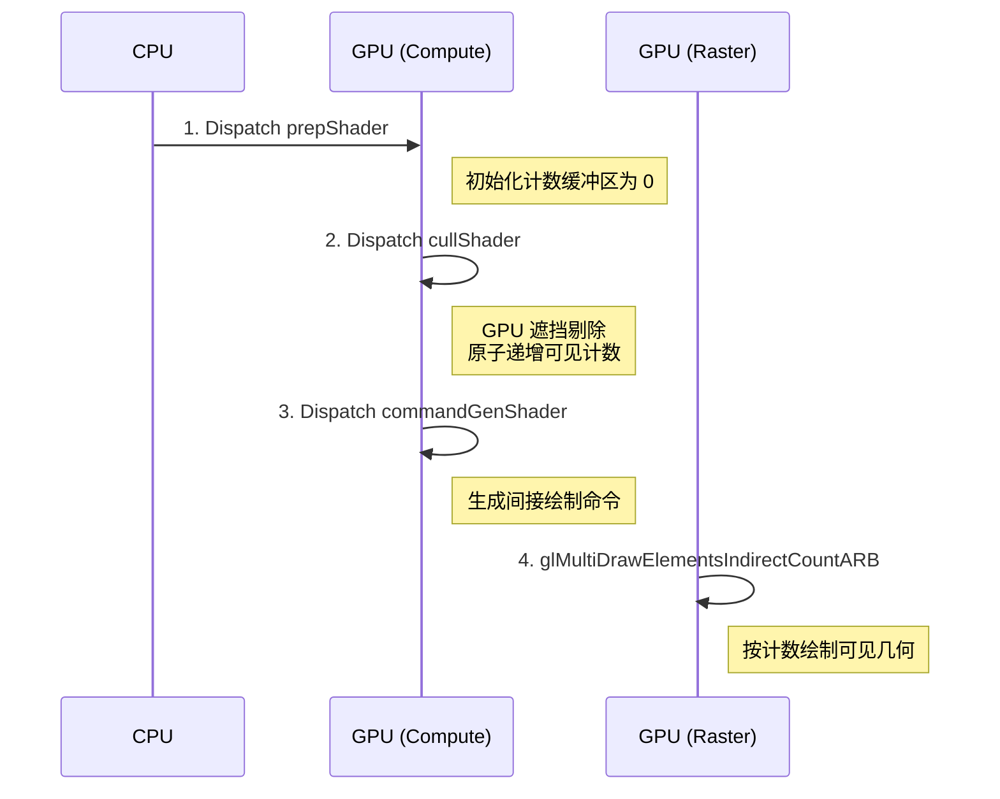
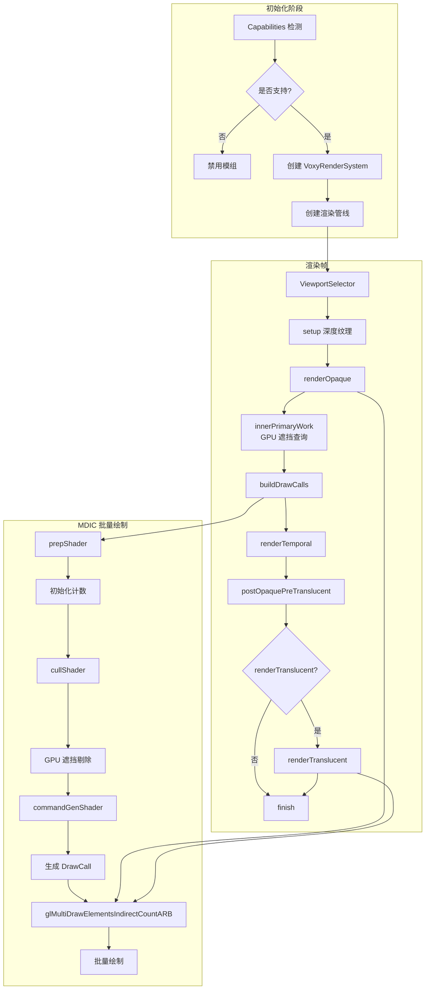
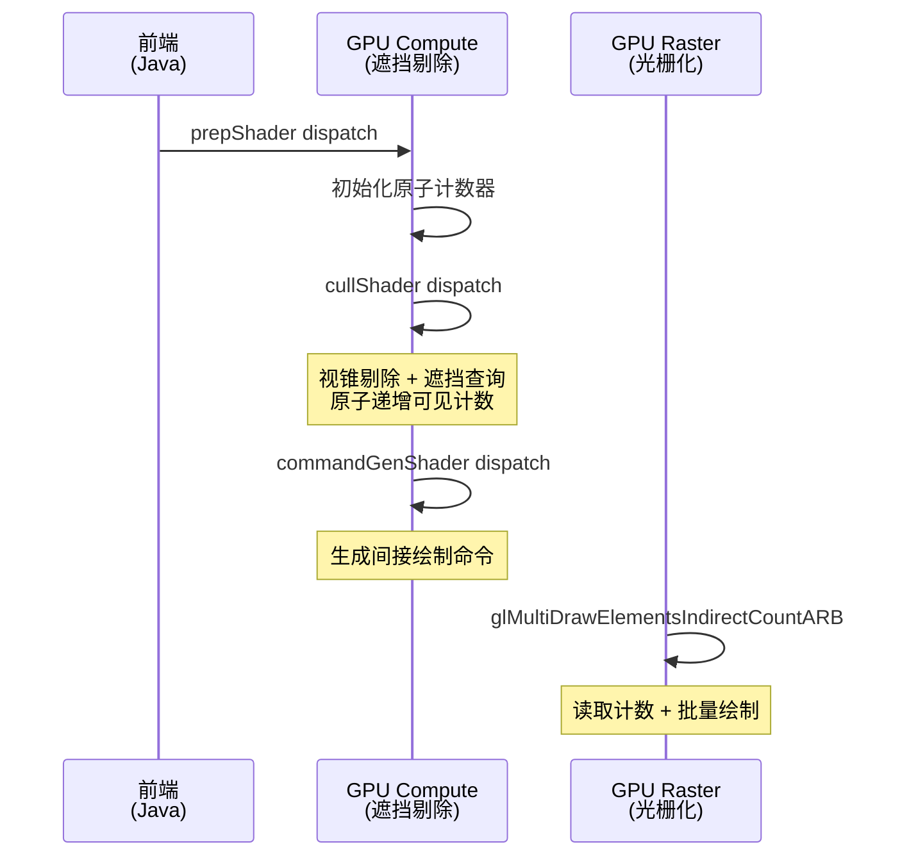

## 致谢

本文档为 Voxy 模组学习笔记，基于 [官方仓库](https://github.com/comp500/voxy) 源码分析撰写。Voxy 是由 comp500 开发的 Minecraft 地形渲染优化模组，采用 AGPL-3.0 许可证。

## 目录

- [为什么需要 GPU 能力检测](#1-为什么需要-gpu-能力检测)
- [GPU 能力检测三要素](#2-gpu-能力检测三要素)
- [扩展检测的可靠性问题](#3-扩展检测的可靠性问题)
- [批量绘制核心：glMultiDrawElementsIndirectCountARB](#4-批量绘制核心glmultielementsindirectcountarb)
- [SharedIndexBuffer：预生成索引模式复用](#5-sharedindexbuffer预生成索引模式复用)
- [MDIC 渲染限制](#6-mdic-渲染限制)
- [渲染管线流程图](#7-渲染管线流程图)
- [简化示例：GPU 能力检测](#8-简化示例gpu-能力检测)
- [课后自查](#课后自查)

---

## 1. 为什么需要 GPU 能力检测

Voxy 的渲染系统高度依赖现代 GPU 特性——Compute Shader 用于遮挡剔除、间接绘制命令减少 CPU 开销、64 位整数运算处理数据。这些特性并非所有 GPU 都支持。

如果直接使用不存在的 GPU 功能，会导致：
- **着色器编译失败**：程序崩溃
- **驱动崩溃**：GPU 死锁或 TDR（超时检测恢复）
- **渲染错误**：贴图错位、深度测试失败

因此，Voxy 在启动时严格检测硬件能力，如果不满足最低要求，直接禁用模组并输出错误信息。

---

## 2. GPU 能力检测三要素

`Capabilities` 类是渲染系统的门槛，检测三个关键能力：

### 2.1 compute：Compute Shader 间接调度

```java
this.compute = cap.glDispatchComputeIndirect != 0;
```

**作用**：支持 `glDispatchComputeIndirect`，允许 GPU 端生成绘制命令。Voxy 的遮挡剔除和命令生成完全在 GPU 上执行，CPU 只需发起一次调度。

**无此能力的 GPU**：所有 GPU 都支持基础 Compute Shader，但 `glDispatchComputeIndirect` 需要 OpenGL 4.3+。

### 2.2 indirectParameters：批量绘制计数

```java
this.indirectParameters = cap.glMultiDrawElementsIndirectCountARB != 0;
```

**作用**：支持 `GL_ARB_multi_draw_elements_indirect_count`，这是批量绘制的核心。没有它，Voxy 无法高效渲染数十万个绘制调用。

**为什么必须**：
```
传统方式（1万个绘制调用）：
┌──────────┐    ┌──────────┐    ┌──────────┐
│ Draw #1  │ →  │ Draw #2  │ →  │ Draw #3  │ → ... → CPU 瓶颈
└──────────┘    └──────────┘    └──────────┘

MDIC 方式（1万个调用）：
┌─────────────────────────────────────────────┐
│ glMultiDrawElementsIndirectCountARB         │
│ 一次性提交所有绘制命令，GPU 自行解析          │
└─────────────────────────────────────────────┘
```

### 2.3 hasBrokenDepthSampler：AMD 深度采样 Bug

```java
if (this.compute && this.isAmd) {
    this.hasBrokenDepthSampler = testDepthSampler();
    if (this.hasBrokenDepthSampler) {
        throw new IllegalStateException("it bork, amd is bork");
    }
}
```

**作用**：检测部分 AMD 显卡的深度纹理采样 Bug。部分 AMD 驱动在 Compute Shader 中使用 `texelFetch` 读取深度纹理时返回错误值。

**检测原理**：
1. 创建深度模板纹理
2. 设置已知深度值
3. 在 Compute Shader 中读取
4. 比较读取值与预期值
5. 如果不符，说明驱动存在 bug

---

## 3. 扩展检测的可靠性问题

### 3.1 扩展标志不一定可靠

驱动报告支持某扩展，不代表实际可用。Voxy 对此有深刻教训：

```java
// ❌ 不可靠：仅依赖 GL 扩展标志
// this.INT64_t = cap.GL_ARB_gpu_shader_int64;

// ✅ 可靠：实际编译着色器验证
this.INT64_t = testShaderCompilesOk(ShaderType.COMPUTE, """
    #version 430
    #extension GL_ARB_gpu_shader_int64 : require
    layout(local_size_x=32) in;
    void main() {
        uint64_t a = 1234;
    }
    """);
```

### 3.2 INT64_t 和 subgroup 检测

```java
// KHR_shader_subgroup 检测
if (cap.GL_KHR_shader_subgroup) {
    this.subgroup = testShaderCompilesOk(ShaderType.COMPUTE, """
        #version 430
        #extension GL_KHR_shader_subgroup_basic : require
        #extension GL_KHR_shader_subgroup_arithmetic : require
        layout(local_size_x=32) in;
        void main() {
            uint a = subgroupExclusiveAdd(gl_LocalInvocationIndex);
        }
        """);
}
```

**关键设计**：通过实际编译着色器来验证特性，而非仅依赖驱动报告的扩展标志。

### 3.3 厂商检测与特殊处理

```java
var vendor = glGetString(GL_VENDOR).toLowerCase(Locale.ROOT);
this.isIntel = vendor.contains("intel");
this.isNvidia = vendor.contains("nvidia");
this.isAmd = vendor.contains("amd") || vendor.contains("radeon");
```

**NVIDIA 显存查询**：

```java
if (this.canQueryGpuMemory) {
    this.totalDedicatedMemory = glGetInteger64(GL_GPU_MEMORY_INFO_DEDICATED_VIDMEM_NVX) * 1024;
    this.totalDynamicMemory = (glGetInteger64(GL_GPU_MEMORY_INFO_TOTAL_AVAILABLE_MEMORY_NVX) * 1024) 
                              - this.totalDedicatedMemory;
}
```

仅 NVIDIA 显卡支持通过 `GL_NVX_gpu_memory_info` 查询显存信息。

---

## 4. 批量绘制核心：glMultiDrawElementsIndirectCountARB

### 4.1 为什么需要批量绘制

Minecraft 地形包含数十万个 mesh，每个 mesh 理论上需要一次 `glDrawElements` 调用。CPU 端提交这么多调用会成为瓶颈。

**MDIC 解决方案**：在 GPU 端预生成所有绘制命令，一次性提交。

### 4.2 绘制命令格式

```c
// DrawElementsIndirect 命令结构
struct DrawElementsIndirectCommand {
    uint  count;         // 索引数量
    uint  primCount;     // 实例数量
    uint  firstIndex;    // 首个索引的偏移
    int   baseVertex;    // 基础顶点偏移
    uint  baseInstance;  // 基础实例偏移
};
```

### 4.3 MDIC 与普通 Indirect 的区别

| 特性 | glDrawElementsIndirect | glMultiDrawElementsIndirectCountARB |
|------|------------------------|-------------------------------------|
| 绘制调用数 | 单个 | 多个 |
| 计数来源 | 命令中指定 | GPU 原子计数 |
| 适用场景 | 已知调用数 | 调用数由 GPU 决定 |
| Voxy 支持 | 不支持 | **必须** |

Voxy 使用 GPU 原子计数器统计可见图元数量，然后使用 MDIC 绘制：



---

## 5. SharedIndexBuffer：预生成索引模式复用

### 5.1 设计目标

Voxy 所有渲染批次复用相同的索引模式，无需为每个 mesh 生成新索引。`SharedIndexBuffer` 预先生成并上传标准索引模式到 GPU。

### 5.2 三种变体

| 变体 | 索引类型 | 最大四边形数 | 适用场景 |
|------|----------|-------------|---------|
| `INSTANCE` | 16-bit short | 16,380 | 标准渲染 |
| `INSTANCE_BYTE` | 8-bit byte | 63 | 少量几何 |
| `INSTANCE_BB_BYTE` | 8-bit byte | 仅立方体 | 实体/AABB |

### 5.3 索引模式生成

```java
public static MemoryBuffer generateQuadIndicesShort(int quadCount) {
    if ((quadCount * 4) >= 1 << 16) {
        throw new ArgumentException("Quad count too large");
    }
    MemoryBuffer buffer = new MemoryBuffer(quadCount * 6L * 2);
    long ptr = buffer.address;
    for (int i = 0; i < quadCount * 4; i += 4) {
        MemoryUtil.memPutShort(ptr + (0 * 2), (short) (i + 1));
        MemoryUtil.memPutShort(ptr + (1 * 2), (short) (i + 2));
        MemoryUtil.memPutShort(ptr + (2 * 2), (short) (i + 0));
        MemoryUtil.memPutShort(ptr + (3 * 2), (short) (i + 1));
        MemoryUtil.memPutShort(ptr + (4 * 2), (short) (i + 3));
        MemoryUtil.memPutShort(ptr + (5 * 2), (short) (i + 2));
        ptr += 6 * 2;
    }
    return buffer;
}
```

**四边形索引模式**：
```
顶点: 0, 1, 2, 3 → 索引: 1, 2, 0, 1, 3, 2 (两个三角形)
```

### 5.4 立方体索引预定义

```java
private static MemoryBuffer generateCubeIndexBuffer() {
    var buffer = new MemoryBuffer(6 * 2 * 3);
    // 每个面 2 个三角形，每个三角形 3 个顶点
    
    // Bottom face:  0,1,2, 3,2,1
    // Top face:     6,5,4, 5,6,7
    // North face:  0,4,1, 5,1,4
    // South face:  3,6,2, 6,3,7
    // West face:   2,4,0, 4,2,6
    // East face:   1,5,3, 7,3,5
}
```

---

## 6. MDIC 渲染限制

`MDICSectionRenderer` 定义了渲染器的硬性限制：

```java
public static final int OPAQUE_DRAW_COUNT = 400_000;      // 不透明绘制上限
public static final int TRANSLUCENT_DRAW_COUNT = 100_000;  // 半透明绘制上限
public static final int TEMPORAL_DRAW_COUNT = 100_000;     // 时序绘制上限
```

### 6.1 为什么需要限制

间接绘制命令存储在固定大小的 GPU 缓冲区中。缓冲区大小决定了最大可存储的绘制命令数量。

### 6.2 限制的意义

| 阶段 | 上限 | 说明 |
|------|------|------|
| OPAQUE | 400,000 | 不透明地形，数量最多 |
| TRANSLUCENT | 100,000 | 半透明地形，需要排序 |
| TEMPORAL | 100,000 | 时序内容（水、肺等） |

如果实际绘制调用超过限制，超出的部分将被忽略（不渲染）。这是性能与正确性的权衡。

---

## 7. 渲染管线流程图



**渲染管线时序**：



---

## 8. 简化示例：GPU 能力检测

```java
public class GpuCapabilityChecker {
    
    public static boolean checkMinimumRequirements() {
        var cap = GL.getCapabilities();
        
        // 必需能力检测
        boolean hasComputeIndirect = cap.glDispatchComputeIndirect != 0;
        boolean hasMdic = cap.glMultiDrawElementsIndirectCountARB != 0;
        
        if (!hasComputeIndirect || !hasMdic) {
            Logger.error("GPU 不支持必需的渲染特性");
            Logger.error("  - Compute Indirect: " + hasComputeIndirect);
            Logger.error("  - MDIC: " + hasMdic);
            return false;
        }
        
        // AMD 深度采样测试
        if (isAmdGpu() && hasComputeIndirect) {
            boolean hasBrokenDepth = testDepthSampler();
            if (hasBrokenDepth) {
                Logger.error("AMD 显卡存在损坏的深度采样器");
                return false;
            }
        }
        
        return true;
    }
    
    private static boolean isAmdGpu() {
        var vendor = glGetString(GL_VENDOR).toLowerCase();
        return vendor.contains("amd") || vendor.contains("radeon");
    }
    
    // 可选能力检测（不强制要求）
    public static void checkOptionalCapabilities() {
        // INT64_t 检测（着色器编译测试）
        boolean hasInt64 = testShaderCompiles("...INT64 shader...");
        
        // Subgroup 检测
        var cap = GL.getCapabilities();
        if (cap.GL_KHR_shader_subgroup) {
            boolean hasSubgroup = testShaderCompiles("...subgroup shader...");
            if (!hasSubgroup) {
                Logger.warn("Subgroup 操作不可用，性能可能受影响");
            }
        }
    }
}
```

**检测结果处理**：

```java
// VoxyClient.java 中的检测逻辑
boolean systemSupported = Capabilities.INSTANCE.compute && 
                          Capabilities.INSTANCE.indirectParameters && 
                          !Capabilities.INSTANCE.hasBrokenDepthSampler;
if (!systemSupported) {
    Logger.error("Voxy is unsupported on your system.");
    // 显示友好的错误消息而非崩溃
}
```

---

## 课后自查

1. **能力检测**：为什么 Voxy 要求 `glMultiDrawElementsIndirectCountARB` 而非普通的 `glDrawElementsIndirect`？两者有何本质区别？

2. **AMD Bug**：AMD 深度采样 Bug 的检测原理是什么？它影响了 Voxy 的哪些渲染阶段？

3. **索引复用**：`SharedIndexBuffer` 为什么提供多种变体（byte/short）？如何选择合适的变体？

4. **渲染限制**：MDIC 渲染限制中的三个上限（400k/100k/100k）分别对应什么渲染阶段？为什么不透明渲染的上限最高？

5. **可靠性**：为什么某些 GPU 特性的检测不能仅依赖扩展标志？Voxy 采用了什么替代方案？

---

**相关文档**：
- [Voxy 架构概览](../01-architecture-overview.md)
- [渲染核心子系统分析](../../analysis/06-rendering-core.md)
- [地形数据摄取系统](../Part-1-Foundation/01-world-ingestion.md)
