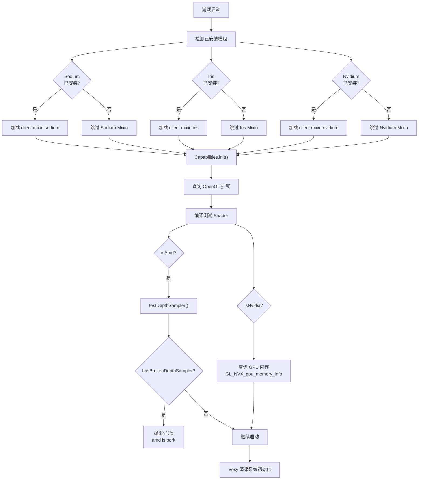

## 致谢

本章节基于 Voxy Mod 0.2.13-alpha (MC 1.21.11) 的开源源码编写，感谢原作者 Cortex 的贡献。

> **声明**：本文档为学习笔记，内容整理自源码分析，非官方文档。

---

## 目录

- [1. 什么是 Mixin？](#1-什么是-mixin)
- [2. Voxy 的 Mixin 注入点一览](#2-voxy-的-mixin-注入点一览)
- [3. 扩展检测原理](#3-扩展检测原理)
- [4. hasBrokenDepthSampler AMD Bug 处理](#4-hasbrokendepthsampler-amd-bug-处理)
- [5. Mermaid 图：Mixin 注入与兼容性决策树](#5-mermaid-图mixin-注入与兼容性决策树)
- [6. 课后自查](#6-课后自查)

---

## 1. 什么是 Mixin？

### 1.1 Mixin 简介

**Mixin** 是 Fabric 模组加载器使用的运行时字节码注入框架。它允许模组在不修改原始类源码的情况下，向目标类的方法插入、修改或重定向代码。

```
┌─────────────────────────────────────────────────────────────┐
│                    Mixin 工作原理                            │
├─────────────────────────────────────────────────────────────┤
│  原始类: Minecraft.class                                    │
│       ↓                                                     │
│  Mixin 处理器扫描 @Mixin 注解的类                            │
│       ↓                                                     │
│  字节码转换器 (Accessor/Redirect/Inject)                    │
│       ↓                                                     │
│  运行时替换方法体 / 插入回调                                 │
│       ↓                                                     │
│  修改后的类 → 加载到 JVM                                    │
└─────────────────────────────────────────────────────────────┘
```

### 1.2 为什么 Voxy 需要 Mixin？

Voxy 作为高性能渲染模组，必须：

1. **拦截渲染流程**：接管 Sodium 的区块渲染
2. **处理第三方着色器**：与 Iris 着色器包兼容
3. **检测硬件能力**：查询 OpenGL 扩展和 GPU 特性
4. **降级兼容性**：在不支持的环境优雅禁用

这些都需要 Mixin 介入 Minecraft 的核心渲染代码。

---

## 2. Voxy 的 Mixin 注入点一览

### 2.1 Mixin 包结构

Voxy 的 Mixin 按目标模组分类：

```
D:\Minecraft-Learning\assets\voxy\src\main\java\me\cortex\voxy\client\mixin\
├── client.mixin.sodium/     ← Sodium 相关
├── client.mixin.iris/       ← Iris 相关
├── client.mixin.flashback/  ← Flashback 录像
├── client.mixin.nvidium/    ← Nvidium 相关
└── client.mixin.minecraft/   ← Minecraft 核心
```

### 2.2 Sodium Mixin 详解

#### MixinDefaultChunkRenderer

这是最核心的 Mixin，负责接管 Sodium 的区块渲染：

```java
// assets/voxy/src/main/java/me/cortex/voxy/client/mixin/sodium/MixinDefaultChunkRenderer.java
@Mixin(value = DefaultChunkRenderer.class, remap = false)
public abstract class MixinDefaultChunkRenderer extends ShaderChunkRenderer {

    @Inject(method = "render", at = @At(value = "HEAD"), cancellable = true)
    private void cancelThingie(ChunkRenderMatrices matrices, ...) {
        if (VoxyClient.disableSodiumChunkRender()) {
            // 取消 Sodium 原生渲染
            ci.cancel();
        }
    }

    @Inject(method = "render", at = @At(value = "INVOKE", target = "L...ShaderChunkRenderer;end()V", shift = At.Shift.BEFORE))
    private void injectRender(...) {
        // 在 Sodium 渲染结束后注入 Voxy 渲染
        this.doRender(...);
    }
}
```

| 注入点 | 行为 | 目的 |
|--------|------|------|
| `HEAD` | `cancellable=true` | 检查是否禁用 Sodium 渲染 |
| `INVOKE.before` | 追加渲染 | 在 Sodium 完成后执行 Voxy 渲染 |

### 2.3 Iris Mixin 详解

#### MixinIris

处理 Iris 着色器加载错误：

```java
@Mixin(value = Iris.class, remap = false)
public class MixinIris {
    @Redirect(method = "createPipeline", 
              at = @At(value = "INVOKE", 
                       target = "Lnet/irisshaders/iris/shaderpack/ShaderPack;getProgramSet(Lnet/irisshaders/iris/shaderpack/materialmap/NamespacedId;)Lnet/irisshaders/iris/shaderpack/programs/ProgramSet;"))
    private static ProgramSet voxy$redirectProgramSet(ShaderPack shaderPack, NamespacedId dim) {
        try {
            return shaderPack.getProgramSet(dim);
        } catch (ShaderLoadError e) {
            Logger.error(e);
            return null;  // 优雅降级
        }
    }
}
```

> 💡 **设计亮点**：使用 `@Redirect` 包装着色器加载，捕获 `ShaderLoadError` 防止崩溃。

### 2.4 其他 Mixin 一览

| Mixin 类 | 目标类 | 注入目的 |
|----------|--------|----------|
| `MixinSodiumWorldRenderer` | SodiumWorldRenderer | 区块追踪器访问器 |
| `MixinRenderRegionManager` | RenderRegionManager | 渲染区域管理 |
| `AccessorChunkTracker` | ChunkTracker | 区块更新追踪 |
| `MixinIrisSamplers` | 纹理采样器 | 自定义采样点处理 |
| `MixinLevelRenderer` | LevelRenderer | 雾气渲染拦截 |

---

## 3. 扩展检测原理

### 3.1 为什么不能依赖 GL_VERSION？

传统的 GPU 功能检测常依赖 `GL_VERSION` 字符串解析：

```java
String version = glGetString(GL_VERSION);
// version = "4.6.0 NVIDIA 535.98"
// version = "4.6 (Core Profile) Mesa 23.1.0"
```

但这种方法的局限性：

1. **厂商差异**：`GL_VERSION` 格式不统一
2. **驱动更新**：相同版本号可能支持不同扩展
3. **Profile 模式**：Core vs Compatibility 行为不同

### 3.2 Voxy 的能力检测策略

Voxy 的 `Capabilities.java` 采用**主动探测**策略：

```java
// assets/voxy/src/main/java/me/cortex/voxy/client/core/gl/Capabilities.java
public class Capabilities {
    // 1. 基础扩展查询
    this.compute = cap.glDispatchComputeIndirect != 0;
    this.meshShaders = cap.GL_NV_mesh_shader;
    this.indirectParameters = cap.glMultiDrawElementsIndirectCountARB != 0;

    // 2. 编译器测试 (对 int64 这种无法直接查询的特性)
    this.INT64_t = testShaderCompilesOk(ShaderType.COMPUTE, """
            #version 430
            #extension GL_ARB_gpu_shader_int64 : require
            ...
            """);

    // 3. 厂商检测
    this.isNvidia = vendor.contains("nvidia");
    this.isAmd = vendor.contains("amd") || vendor.contains("radeon");
    this.isIntel = vendor.contains("intel");
    this.isMesa = glGetString(GL_VERSION).toLowerCase().contains("mesa");
}
```

### 3.3 支持的扩展一览

| 特性 | 检测方式 | 用途 |
|------|----------|------|
| `compute` | 函数指针 != null | GPU 计算着色器 |
| `meshShaders` | `GL_NV_mesh_shader` | Mesh Shader 渲染 |
| `INT64_t` | 着色器编译测试 | 64 位整数支持 |
| `subgroup` | `GL_KHR_shader_subgroup` + 编译测试 | SIMD 子组操作 |
| `sparseBuffer` | `GL_ARB_sparse_buffer` | 稀疏缓冲区 |
| `nvBarryCoords` | `GL_NV_fragment_shader_barycentric` | 重心坐标插值 |

---

## 4. hasBrokenDepthSampler AMD Bug 处理

### 4.1 问题背景

某些 AMD 显卡（尤其是较老的 GCN 架构）在使用深度模板纹理时存在硬件 Bug：

- **症状**：Compute Shader 中读取 `sampler2D depthSampler` 返回错误值
- **影响**：Voxy 的雾效、深度感知渲染可能失效

### 4.2 检测流程

Voxy 通过运行时测试验证此 Bug：

```java
// assets/voxy/src/main/java/me/cortex/voxy/client/core/gl/Capabilities.java
if (this.compute && this.isAmd) {
    this.hasBrokenDepthSampler = testDepthSampler();
    if (this.hasBrokenDepthSampler) {
        throw new IllegalStateException("it bork, amd is bork");
    }
}
```

### 4.3 测试原理

`testDepthSampler()` 方法创建一个 Compute Shader 测试程序：

```glsl
#version 460 core
layout(binding = 0) uniform sampler2D depthSampler;
layout(binding = 1) buffer OutData { float[] outData; };
layout(location = 2) uniform int dynamicSampleThing;
layout(location = 3) uniform float sampleData;

void main() {
    // 读取深度值并与预期比较
    if (abs(texelFetch(depthSampler, ivec2(gl_GlobalInvocationID.xy), dynamicSampleThing).r
            - sampleData) > 0.000001f) {
        outData[0] = 1.0;  // 标记错误
    }
}
```

测试步骤：
1. 创建 256×256 的 `DEPTH24_STENCIL8` 纹理
2. 设置已知的深度值 (0.0 ~ 1.0)
3. 在 Compute Shader 中读取并验证
4. 如果读取值与写入值不符 → Bug 存在

### 4.4 后续影响

当检测到 Bug 时：
- Voxy 会直接抛出异常终止启动
- 用户需要切换到兼容的渲染路径（如禁用 Compute Shader 雾效）
- 未来可能实现软件降级 fallback

---

## 5. Mermaid 图：Mixin 注入与兼容性决策树



### 渲染注入时序图

```mermaid
sequenceDiagram
    participant Minecraft
    participant Sodium
    participant Voxy
    participant Iris

    rect rgb(50, 50, 80)
        Note over Minecraft,Iris: 初始化阶段
        Minecraft->>Sodium: 加载 Sodium 模组
        Minecraft->>Iris: 加载 Iris 模组
        Sodium->>Voxy: 注册 Mixin
        Iris->>Voxy: 注册 Mixin
    end

    rect rgb(50, 80, 50)
        Note over Minecraft,Voxy: 渲染帧
        Minecraft->>Sodium: 调用 DefaultChunkRenderer.render()
        Sodium->>Voxy: Mixin: HEAD 拦截
        alt Voxy 禁用 Sodium 渲染
            Voxy->>Sodium: ci.cancel()
        else 正常渲染
            Sodium->>Voxy: Mixin: INVOKE.before 注入
            Voxy->>Voxy: renderOpaque()
        end
        Sodium->>Voxy: Mixin: END 后注入
        Voxy->>Iris: 如果着色器包启用
    end
```



---

## 6. 课后自查

- [ ] Mixin 的 `@Inject(cancellable = true)` 与普通注入有何区别？
- [ ] 为什么 `MixinDefaultChunkRenderer` 需要同时使用 `HEAD` 取消和 `INVOKE.before` 注入？
- [ ] `testShaderCompilesOk()` 为什么比直接查询 `GL_ARB_gpu_shader_int64` 更可靠？
- [ ] `hasBrokenDepthSampler` 测试的深度值范围是多少？精度阈值 `0.000001f` 依据是什么？
- [ ] 如果用户使用 Intel 集显 + AMD 独显的混合模式，Voxy 如何检测？

---

## 参考文件

- `assets/voxy/src/main/java/me/cortex/voxy/client/core/gl/Capabilities.java`
- `assets/voxy/src/main/java/me/cortex/voxy/client/mixin/sodium/MixinDefaultChunkRenderer.java`
- `assets/voxy/src/main/java/me/cortex/voxy/client/mixin/iris/MixinIris.java`
- [官方仓库](https://github.com/comp500/voxy)
