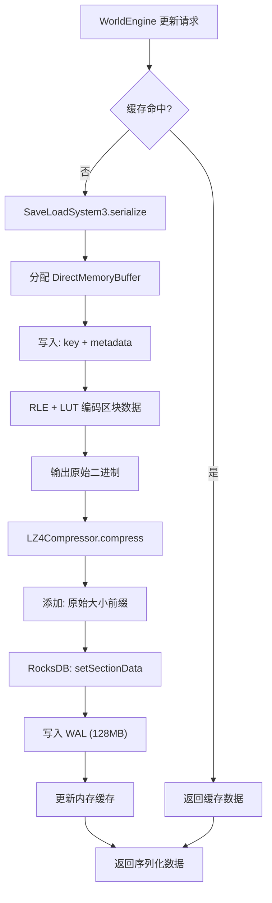
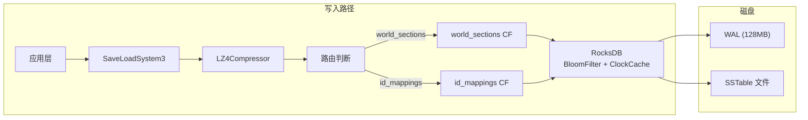

## 致谢

本章节基于 Voxy Mod 0.2.13-alpha (MC 1.21.11) 的开源源码编写，感谢原作者 Cortex 的贡献。

> **声明**：本文档为学习笔记，内容整理自源码分析，非官方文档。

---

## 目录

- [1. 为什么要用 RocksDB？](#1-为什么要用-rocksdb)
- [2. RocksDB Column Family 配置](#2-rocksdb-column-family-配置)
- [3. LZ4 + ZSTD 双压缩策略](#3-lz4--zstd-双压缩策略)
- [4. 装饰器模式：CompressionStorageAdaptor](#4-装饰器模式compositorstorageadaptor)
- [5. ID Mapping 持久化机制](#5-id-mapping-持久化机制)
- [6. Mermaid 图：存储写入流程](#6-mermaid-图存储写入流程)
- [7. 课后自查](#7-课后自查)

---

## 1. 为什么要用 RocksDB？

### 1.1 文件系统的问题

如果直接用文件系统存储 Section 数据：

```
world/voxy/
├── section_0_0_-10.db
├── section_0_0_-9.db
├── section_0_0_-8.db
├── ...
```

存在的问题：

| 问题 | 影响 |
|------|------|
| **元数据开销** | 每个文件都有 inode、权限、创建时间等元数据 |
| **小文件碎片** | 16³ Section ≈ 40KB，大量小文件导致文件系统碎片化 |
| **并发限制** | 文件系统锁和目录遍历开销大 |
| **命名空间** | 大量文件导致目录膨胀，ls/rm 操作变慢 |

### 1.2 RocksDB 的优势

RocksDB 是嵌入式键值存储，专为大规模数据设计：

```
┌─────────────────────────────────────────────────────────────┐
│                    RocksDB vs 文件系统                        │
├─────────────────────────────────────────────────────────────┤
│  ✅ 单一数据库文件，数据紧凑存储                              │
│  ✅ 列族 (Column Family) 分组管理                           │
│  ✅ BloomFilter 快速判断 key 是否存在                        │
│  ✅ 增量压缩，平衡 CPU 和空间                               │
│  ✅ WAL (Write-Ahead Log) 防止崩溃丢失                      │
│  ✅ 后台 compaction 自动合并碎片                            │
└─────────────────────────────────────────────────────────────┘
```

---

## 2. RocksDB Column Family 配置

### 2.1 两个列族的分工

Voxy 使用两个独立的 Column Family 存储不同类型的数据：

```java
// assets/voxy/src/main/java/me/cortex/voxy/common/config/storage/rocksdb/RocksDBStorageBackend.java
public RocksDBStorageBackend(String path) {
    // Column Family 1: world_sections - 存储 Section 数据
    final ColumnFamilyOptions cfWorldSecOpts = new ColumnFamilyOptions()
            .setCompressionType(CompressionType.NO_COMPRESSION)  // 外层 LZ4 压缩
            .setBloomFilter(new BloomFilter(10));  // 10 bits/entry

    // Column Family 2: id_mappings - 存储 ID 映射
    // 使用默认压缩 (ZSTD)
}
```

### 2.2 Column Family 配置详解

#### world_sections 配置

```java
// BloomFilter: 10 bits/entry ≈ 0.1% 假阳性
var filter = new BloomFilter(10);

// HyperClockCache: 128MB 缓存索引和过滤器
var bCache = new HyperClockCache(128*1024L*1024L, 0, 4, false);

cfWorldSecOpts.setTableFormatConfig(new BlockBasedTableConfig()
    .setCacheIndexAndFilterBlocksWithHighPriority(true)
    .setBlockCache(bCache)
    .setFilterPolicy(filter)
    .setDataBlockIndexType(DataBlockIndexType.kDataBlockBinaryAndHash)
);
```

| 参数 | 值 | 说明 |
|------|-----|------|
| `BloomFilter` | 10 bits/entry | 约 0.1% 假阳性，加速"不存在"查询 |
| `HyperClockCache` | 128MB | 索引和过滤器块缓存，减少磁盘 I/O |
| `CompressionType` | NO_COMPRESSION | 外层应用自行压缩 |

#### id_mappings 配置

```java
final List<ColumnFamilyDescriptor> cfDescriptors = Arrays.asList(
    new ColumnFamilyDescriptor(RocksDB.DEFAULT_COLUMN_FAMILY, cfOpts),  // default
    new ColumnFamilyDescriptor("world_sections".getBytes(), cfWorldSecOpts),
    new ColumnFamilyDescriptor("id_mappings".getBytes(), cfOpts)  // 使用 ZSTD
);
```

### 2.3 WAL 配置

```java
// WAL 128MB 防止数据丢失
final DBOptions options = new DBOptions()
        .setMaxTotalWalSize(1024*1024*128);
```

> 💡 **设计意图**：崩溃时最多丢失 128MB 未刷盘数据，平衡性能和安全。

---

## 3. LZ4 + ZSTD 双压缩策略

### 3.1 两种压缩器对比

| 特性 | LZ4 | ZSTD |
|------|-----|------|
| **压缩速度** | ~5 GB/s | ~1 GB/s |
| **解压速度** | ~5 GB/s | ~2 GB/s |
| **压缩率** | ~2x | ~3-5x |
| **内存占用** | 低 | 中 |
| **典型场景** | 热数据、高频读写 | 冷数据、长期存储 |

### 3.2 Voxy 的分配策略

```java
// assets/voxy/src/main/java/me/cortex/voxy/common/config/compressors/LZ4Compressor.java
public class LZ4Compressor implements StorageCompressor {
    private final net.jpountz.lz4.LZ4Compressor compressor;
    private final net.jpountz.lz4.LZ4FastDecompressor decompressor;

    public LZ4Compressor() {
        this.decompressor = LZ4Factory.nativeInstance().fastDecompressor();
        this.compressor = LZ4Factory.nativeInstance().fastCompressor();
    }
}
```

```java
// assets/voxy/src/main/java/me/cortex/voxy/common/config/compressors/ZSTDCompressor.java
public class ZSTDCompressor implements StorageCompressor {
    private static final ThreadLocal<Ref> COMPRESSION_CTX =
        ThreadLocal.withInitial(ZSTDCompressor::createCleanableCompressionContext);
}
```

### 3.3 Section 压缩格式

```java
// assets/voxy/src/main/java/me/cortex/voxy/common/config/compressors/LZ4Compressor.java
public MemoryBuffer compress(MemoryBuffer saveData) {
    var res = SCRATCH.get(...);
    MemoryUtil.memPutInt(res.address, (int) saveData.size);  // 前4字节存原始大小
    int size = this.compressor.compress(...);
    return res.subSize(size+4);  // [4字节大小][压缩数据]
}
```

---

## 4. 装饰器模式：CompressionStorageAdaptor

### 4.1 设计模式

`CompressionStorageAdaptor` 使用**装饰器模式**，在底层存储上透明添加压缩功能：

```
┌─────────────────────────────────────────────────────────────┐
│                  装饰器模式结构                              │
├─────────────────────────────────────────────────────────────┤
│                                                             │
│  ┌─────────────────────────┐                               │
│  │   StorageBackend        │  ← 抽象基类                    │
│  │   (接口定义)             │                               │
│  └───────────┬─────────────┘                               │
│              △                                               │
│              │                                               │
│  ┌───────────┴─────────────┐     ┌────────────────────────┐ │
│  │ DelegatingStorageAdaptor │     │  CompressionStorage   │ │
│  │   (转发请求)             │◁────│    Adaptor            │ │
│  └───────────┬─────────────┘     │  (添加压缩)            │ │
│              │                   └───────────┬────────────┘ │
│              │                               │               │
│  ┌───────────┴─────────────┐                 │               │
│  │ RocksDBStorageBackend   │◀────────────────┘               │
│  │   (实际存储)             │                                 │
│  └─────────────────────────┘                                 │
└─────────────────────────────────────────────────────────────┘
```

### 4.2 透明压缩实现

```java
// assets/voxy/src/main/java/me/cortex/voxy/common/config/storage/other/CompressionStorageAdaptor.java
public class CompressionStorageAdaptor extends DelegatingStorageAdaptor {
    private final StorageCompressor compressor;

    @Override
    public MemoryBuffer getSectionData(long key, MemoryBuffer scratch) {
        // 1. 从底层读取（可能是压缩数据）
        var data = this.delegate.getSectionData(key, scratch);
        if (data == null) {
            return null;
        }
        // 2. 透明解压
        return this.compressor.decompress(data);
    }

    @Override
    public void setSectionData(long key, MemoryBuffer data) {
        // 1. 透明压缩
        var cdata = this.compressor.compress(data);
        // 2. 写入底层
        this.delegate.setSectionData(key, cdata);
    }
}
```

### 4.3 优势

1. **无感知使用**：调用方无需知道数据是否被压缩
2. **可叠加**：可以同时添加压缩和加密适配器
3. **可替换**：可以随时更换压缩算法
4. **易测试**：可以单独测试存储或压缩模块

---

## 5. ID Mapping 持久化机制

### 5.1 为什么需要 ID Mapping？

Minecraft 的方块状态数量庞大（~10,000+），且可扩展。Voxy 需要将：

```
Minecraft BlockState 对象
    ↓ 映射
紧凑的整数 ID (0 ~ 1,048,575)
```

### 5.2 ID 编码方案

```java
// assets/voxy/src/main/java/me/cortex/voxy/common/world/other/Mapper.java
int entryType = entry.getIntKey() >>> 30;  // 高 2 bits
int id = entry.getIntKey() & ((1 << 30) - 1);  // 低 30 bits
```

```
bits [31..30] = entryType (2 bits)
  01 = BlockState
  10 = Biome
bits [29..0] = id (30 bits, 0 ~ 2^30-1)
```

### 5.3 序列化格式

```java
public byte[] serialize() {
    var serialized = new CompoundTag();
    serialized.putInt("id", this.id);
    serialized.put("block_state", BlockState.CODEC.encodeStart(...));
    var out = new ByteArrayOutputStream();
    NbtIo.writeCompressed(serialized, out);  // Zlib 压缩
    return out.toByteArray();
}
```

### 5.4 版本兼容处理

```java
public static StateEntry deserialize(int id, byte[] data, boolean[] forceResave) {
    var compound = NbtIo.readCompressed(...);
    var state = BlockState.CODEC.parse(NbtOps.INSTANCE, bsc);

    if (state.isError()) {
        // DataFixerUpper 修复旧版本数据
        bsc = (CompoundTag) DataFixers.getDataFixer().update(
            References.BLOCK_STATE,
            new Dynamic<>(NbtOps.INSTANCE, bsc),
            0,
            SharedConstants.getCurrentVersion().dataVersion().version()
        ).getValue();
        state = BlockState.CODEC.parse(NbtOps.INSTANCE, bsc);
        forceResave[0] |= true;  // 触发重新保存
    }
}
```

---

## 6. Mermaid 图：存储写入流程

### 6.1 完整写入流程



### 6.2 Column Family 路由



---

## 7. 课后自查

- [ ] 为什么 `world_sections` 列族设置 `NO_COMPRESSION` 而不是使用 RocksDB 内置压缩？
- [ ] BloomFilter 的 10 bits/entry 是如何计算假阳性率的？
- [ ] `DelegatingStorageAdaptor` 的 `getChildBackends()` 方法有什么作用？
- [ ] 为什么 ID 编码使用 `>>> 30` 而不是 `>> 30`？
- [ ] 如果游戏更新了 BlockState 的定义格式，`DataFixerUpper` 如何自动迁移数据？

---

## 参考文件

- `assets/voxy/src/main/java/me/cortex/voxy/common/config/storage/StorageBackend.java`
- `assets/voxy/src/main/java/me/cortex/voxy/common/config/storage/rocksdb/RocksDBStorageBackend.java`
- `assets/voxy/src/main/java/me/cortex/voxy/common/config/storage/other/CompressionStorageAdaptor.java`
- `assets/voxy/src/main/java/me/cortex/voxy/common/config/compressors/LZ4Compressor.java`
- `assets/voxy/src/main/java/me/cortex/voxy/common/config/compressors/ZSTDCompressor.java`
- `assets/voxy/src/main/java/me/cortex/voxy/common/world/other/Mapper.java`
- [官方仓库](https://github.com/comp500/voxy)
