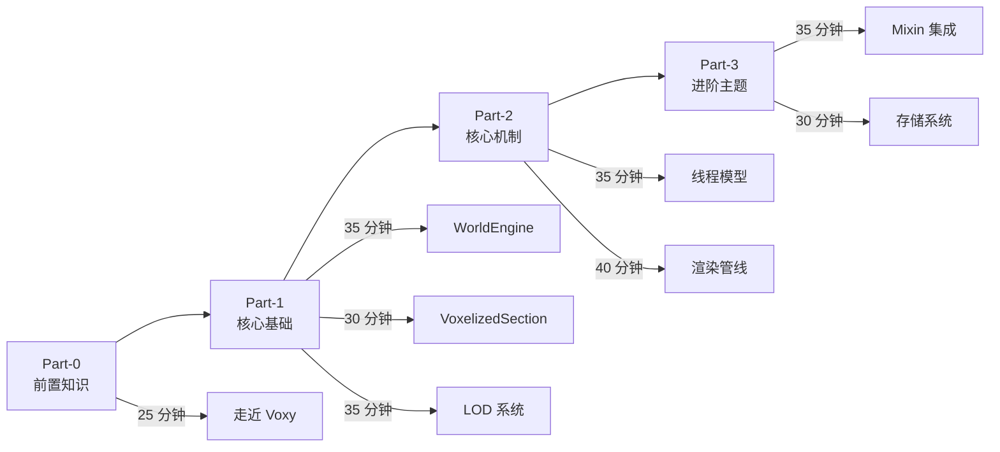

# Voxy 教程

> 从零开始学习 Voxy 模组的 LOD 远距离渲染技术

本系列教程面向希望深入理解 Voxy 模组工作原理的开发者。通过本系列，你将掌握：

- LOD (Level of Detail) 渲染的核心概念
- 世界引擎的数据结构设计
- 多线程任务调度系统
- GPU 渲染管线集成
- 持久化存储方案

## 教程目录

### Part 0：前置知识

| 章节 | 文件 | 内容简述 |
|------|------|----------|
| Voxy 入门 | [01-voxy-intro.md](./Part-0-Prerequisites/01-voxy-intro.md) | LOD 概念、Voxy 架构总览、数据流概述 |

### Part 1：核心基础

| 章节 | 文件 | 内容简述 |
|------|------|----------|
| 世界引擎基础 | [01-world-engine-basics.md](./Part-1-Foundation/01-world-engine-basics.md) | WorldSection、WorldEngine、引用计数机制 |
| 体素化区块 | [02-voxelized-section.md](./Part-1-Foundation/02-voxelized-section.md) | VoxelizedSection 结构、37 bits 编码、4913 longs 存储 |
| LOD 系统 | [03-lod-system.md](./Part-1-Foundation/03-lod-system.md) | 5 级 LOD 生成算法、WorldUpdater 传播、双层 LRU 缓存 |

### Part 2：核心机制

| 章节 | 文件 | 内容简述 |
|------|------|----------|
| 线程模型 | [01-thread-model.md](./Part-2-Core-Mechanisms/01-thread-model.md) | 3 个 Worker 线程、ServiceManager 加权调度、VoxelIngestService |
| 渲染管线 | [02-rendering-pipeline.md](./Part-2-Core-Mechanisms/02-rendering-pipeline.md) | GPU 能力检测、MDIC 批量绘制、SharedIndexBuffer |

### Part 3：进阶主题

| 章节 | 文件 | 内容简述 |
|------|------|----------|
| Mixin 集成 | [01-mixin-integration.md](./Part-3-Advanced/01-mixin-integration.md) | Sodium/Iris 兼容性、Capabilities 检测、AMD Bug 处理 |
| 存储系统 | [02-storage-system.md](./Part-3-Advanced/02-storage-system.md) | RocksDB、Column Family、LZ4+ZSTD 双压缩 |

## 学习路径建议

| 学习阶段 | 预计时长 | 推荐章节 |
|----------|----------|----------|
| 入门 | ~25 分钟 | Part-0 |
| 基础 | ~100 分钟 | Part-1 全部 |
| 进阶 | ~75 分钟 | Part-2 全部 |
| 高级 | ~65 分钟 | Part-3 全部 |

## 参考资料

### 分析文档

深入学习各子系统的内部实现：

| 文档 | 内容 |
|------|------|
| [01-architecture-overview.md](../1.21.11-fabric-0.2.13-alpha/analysis/01-architecture-overview.md) | 架构总览 |
| [02-world-engine.md](../1.21.11-fabric-0.2.13-alpha/analysis/02-world-engine.md) | 世界引擎 |
| [03-voxelization-system.md](../1.21.11-fabric-0.2.13-alpha/analysis/03-voxelization-system.md) | 体素化系统 |
| [04-storage-persistence.md](../1.21.11-fabric-0.2.13-alpha/analysis/04-storage-persistence.md) | 持久化存储 |
| [05-thread-service.md](../1.21.11-fabric-0.2.13-alpha/analysis/05-thread-service.md) | 线程服务 |
| [06-rendering-core.md](../1.21.11-fabric-0.2.13-alpha/analysis/06-rendering-core.md) | 渲染核心 |
| [07-world-importers.md](../1.21.11-fabric-0.2.13-alpha/analysis/07-world-importers.md) | 世界导入器 |
| [08-config-system.md](../1.21.11-fabric-0.2.13-alpha/analysis/08-config-system.md) | 配置系统 |

### 源码路径

`D:\Minecraft-Learning\assets\voxy\src\main\java\me\cortex\voxy\`

### 外部链接

- 官方仓库：[comp500/voxy](https://github.com/comp500/voxy)
- 模组主页：[CurseForge / Modrinth](https://modrinth.com/mod/voxy)

---

## 贡献者

本教程系列基于 Voxy 模组 0.2.13-alpha (Minecraft 1.21.11) 源码分析编写。感谢原作者 **Cortex** 的开源贡献。
