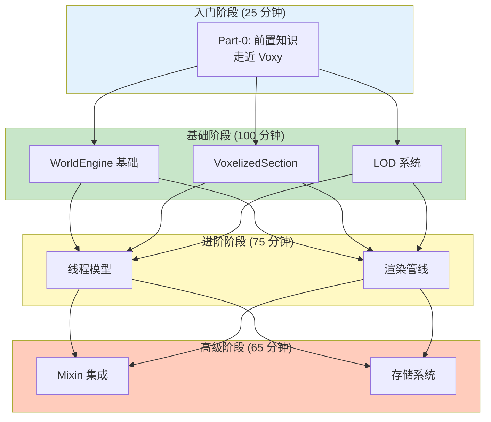

# Voxy 教程总结

本页面汇总 Voxy 教程系列的核心知识点，方便快速查阅。

## 学习路径



## 核心要点速查表

### Part 0：前置知识

| 概念 | 要点 |
|------|------|
| **LOD** | Level of Detail，根据距离切换不同精度模型 |
| **5 级 LOD** | L0(32³) → L1(64³) → L2(128³) → L3(256³) → L4(512³) |
| **Section 大小** | 32×32×32 = 32,768 体素 |
| **压缩比** | L4 相比 L0 达到 1:4096 |

### Part 1：核心基础

| 组件 | 核心要点 |
|------|----------|
| **WorldSection** | 32³ 数据容器，引用计数机制（最低位=加载标志） |
| **VoxelizedSection** | 4913 longs 存储 5 级 LOD，每体素 37 bits 编码 |
| **WorldEngine** | 世界引擎主控制器，64-bit Section ID 编码 |
| **WorldUpdater** | LOD 更新向上传播，支持传播终止优化 |
| **Mipper** | 8→1 合并算法，基于不透明度选择保留体素 |
| **ActiveSectionTracker** | 分片哈希表 + LRU 双向链表，双层缓存设计 |

### Part 2：核心机制

| 组件 | 核心要点 |
|------|----------|
| **UnifiedServiceThreadPool** | 3 个 Worker 线程，优先级 3，守护线程 |
| **ServiceManager** | 加权随机选取算法（shiftFactor 公平性） |
| **VoxelIngestService** | weight=5000，无限流，区块摄入 |
| **SectionSavingService** | weight=100，双层限流，软上限 5000 |
| **Capabilities** | GPU 能力检测（Compute/Indirect/INT64） |
| **MDIC** | glMultiDrawElementsIndirectCountARB，批量绘制 |
| **SharedIndexBuffer** | 预生成索引模式复用 |

### Part 3：进阶主题

| 组件 | 核心要点 |
|------|----------|
| **MixinDefaultChunkRenderer** | @Inject(cancellable)，HEAD 取消 + INVOKE.before 注入 |
| **AMD Bug** | hasBrokenDepthSampler，深度纹理采样测试 |
| **RocksDB** | Column Family (world_sections, id_mappings) |
| **BloomFilter** | 10 bits/entry，约 0.1% 假阳性率 |
| **LZ4+ZSTD** | 热数据用 LZ4（快），冷数据用 ZSTD（高压缩率） |
| **CompressionStorageAdaptor** | 装饰器模式，透明压缩 |

## 源码路径速查

| 组件 | 路径 |
|------|------|
| **WorldSection** | `common/world/WorldSection.java` |
| **WorldEngine** | `common/world/WorldEngine.java` |
| **VoxelizedSection** | `common/voxelization/VoxelizedSection.java` |
| **WorldUpdater** | `common/world/WorldUpdater.java` |
| **ActiveSectionTracker** | `common/world/ActiveSectionTracker.java` |
| **Mapper** | `common/world/other/Mapper.java` |
| **Mipper** | `common/world/other/Mipper.java` |
| **UnifiedServiceThreadPool** | `common/thread/UnifiedServiceThreadPool.java` |
| **ServiceManager** | `common/thread/ServiceManager.java` |
| **Capabilities** | `client/core/gl/Capabilities.java` |
| **MixinDefaultChunkRenderer** | `client/mixin/sodium/MixinDefaultChunkRenderer.java` |
| **RocksDBStorageBackend** | `common/config/storage/rocksdb/RocksDBStorageBackend.java` |
| **CompressionStorageAdaptor** | `common/config/storage/other/CompressionStorageAdaptor.java` |

## 关键数据总结

### VoxelizedSection 内存布局

```
4096 longs (L0: 16³)   [偏移 0]
 512 longs (L1: 8³)    [偏移 4096]
  64 longs (L2: 4³)    [偏移 4608]
   8 longs (L3: 2³)    [偏移 4672]
   1 long  (L4: 1³)    [偏移 4680]
───────────────────────────────
总计: 4681 longs ≈ 37 KB per section
```

### 37 bits 体素编码

```
Bits 63-56 (8 bits): light    (0-255)
Bits 47-55 (9 bits): biome    (0-511)
Bits 27-46 (20 bits): block   (0-1,048,575)
```

### Section ID 64-bit 布局

```
Bits 60-63: lvl    (LOD 层级, 0-15)
Bits 52-59: y      (Y 坐标, 0-255)
Bits 28-51: z      (Z 坐标, 0-16M)
Bits  4-27: x      (X 坐标, 0-16M)
Bits  0-3:  spare  (预留扩展)
```

### 线程权重配置

| Service | Weight | 相对比例 |
|---------|--------|----------|
| VoxelIngestService | 5000 | 98% |
| SectionSavingService | 100 | 2% |

## 相关链接

### 分析文档

- [架构总览](../1.21.11-fabric-0.2.13-alpha/analysis/01-architecture-overview.md)
- [世界引擎](../1.21.11-fabric-0.2.13-alpha/analysis/02-world-engine.md)
- [体素化系统](../1.21.11-fabric-0.2.13-alpha/analysis/03-voxelization-system.md)
- [持久化存储](../1.21.11-fabric-0.2.13-alpha/analysis/04-storage-persistence.md)
- [线程服务](../1.21.11-fabric-0.2.13-alpha/analysis/05-thread-service.md)
- [渲染核心](../1.21.11-fabric-0.2.13-alpha/analysis/06-rendering-core.md)
- [世界导入器](../1.21.11-fabric-0.2.13-alpha/analysis/07-world-importers.md)
- [配置系统](../1.21.11-fabric-0.2.13-alpha/analysis/08-config-system.md)
- [分析总结](../1.21.11-fabric-0.2.13-alpha/analysis/SUMMARY.md)

### 外部资源

- 官方仓库：https://github.com/comp500/voxy
- 模组下载：https://modrinth.com/mod/voxy
