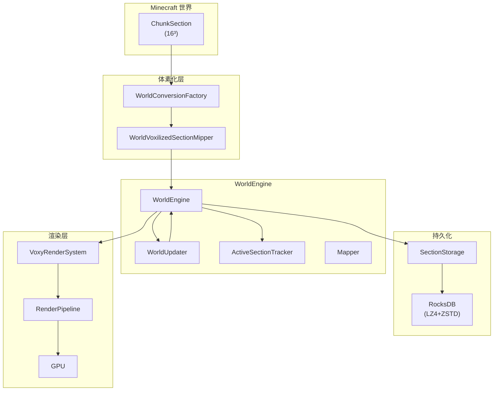

# Voxy

> Far distance rendering mod utilizing LoDs (Level of Detail)

## 概述

Voxy 是一款 Minecraft Fabric 模组，通过引入**多级 LOD（Level of Detail）技术**实现远距离地形渲染。与原版 Minecraft 使用 16x16x16 的 chunk section 不同，voxy 将世界重组为 **32x32x32** 的 section，配合 0-4 共五级 LOD 层，将远距离区块以极低的多边形量渲染到地平线。

## 模组信息

| 属性 | 值 |
|------|------|
| **Mod ID** | `voxy` |
| **版本** | 0.2.13-alpha |
| **Minecraft 版本** | 1.21.11 |
| **加载器** | Fabric |
| **作者** | Cortex |
| **源码许可** | All-Rights-Reserved |

> 本文档为第三方学习笔记，以[官方仓库](https://github.com/comp500/voxy)与许可证为准。

## 核心特性

- **5 级 LOD 渲染**：覆盖 32³ 到 512³ 的完整距离范围
- **RocksDB 持久化**：嵌入式高性能键值存储
- **GPU 批量绘制**：使用 `glMultiDrawElementsIndirectCountARB` 合并成千上万的绘制调用
- **多模组兼容**：深度集成 Sodium、Iris、Chunky、Lithium
- **世界导入**：支持从标准 MCA 文件、Distant Horizons 数据库导入数据
- **Compute Shader 遮挡剔除**：GPU 端判断可见性

## 依赖关系

voxy 依赖以下模组和库：

| 依赖 | 版本 | 作用 |
|------|------|------|
| **Sodium** | 0.8.4 / 0.8.6 | 必需，区块渲染拦截 |
| **Iris** | 1.10.6+ | 可选，着色器兼容 |
| **Lithium** | 0.21.0+ | 可选，HashPalette 优化 |
| **Chunky** | 1.4.54+ | 可选，预渲染支持 |
| **ModMenu** | 17.0.0+ | 可选，配置界面 |
| **RocksDB** | 10.2.1 | 内嵌存储引擎 |
| **Jedis** | 5.1.0 | Redis 客户端（可选） |
| **ZSTD/LZ4/XZ** | - | 数据压缩 |

## 文档结构

```
content/voxy/
├── README.md                                    # 模组首页
└── 1.21.11-fabric-0.2.13-alpha/
    ├── analysis/        # 分析文档（详见下方）
    └── tutorials/       # 教程文档
        ├── README.md                            # 教程索引
        ├── SUMMARY.md                           # 教程总结
        ├── Part-0-Prerequisites/
        │   └── 01-voxy-intro.md                 # 走近 Voxy
        ├── Part-1-Foundation/
        │   ├── 01-world-engine-basics.md        # 世界引擎基础
        │   ├── 02-voxelized-section.md          # 体素化区块
        │   └── 03-lod-system.md                 # LOD 系统
        ├── Part-2-Core-Mechanisms/
        │   ├── 01-thread-model.md               # 线程模型
        │   └── 02-rendering-pipeline.md         # 渲染管线
        └── Part-3-Advanced/
            ├── 01-mixin-integration.md           # Mixin 集成
            └── 02-storage-system.md              # 存储系统
```

## 架构一览



## 源码路径

`D:\Minecraft-Learning\assets\voxy\src\main\java\me\cortex\voxy\`

## 分析文档

### 架构总览
[01-architecture-overview.md](./1.21.11-fabric-0.2.13-alpha/analysis/01-architecture-overview.md) — 整体架构、LOD 概念、线程模型、存储系统、Mixin 依赖关系

### 子系统分析
- [02-world-engine.md](./1.21.11-fabric-0.2.13-alpha/analysis/02-world-engine.md) — WorldSection、WorldEngine、WorldUpdater、ActiveSectionTracker
- [03-voxelization-system.md](./1.21.11-fabric-0.2.13-alpha/analysis/03-voxelization-system.md) — VoxelizedSection、WorldConversionFactory、LOD Mipper
- [04-storage-persistence.md](./1.21.11-fabric-0.2.13-alpha/analysis/04-storage-persistence.md) — RocksDB、压缩算法、存储抽象
- [05-thread-service.md](./1.21.11-fabric-0.2.13-alpha/analysis/05-thread-service.md) — UnifiedServiceThreadPool、ServiceManager、优先级调度
- [06-rendering-core.md](./1.21.11-fabric-0.2.13-alpha/analysis/06-rendering-core.md) — RenderEngine、Capabilities 检测、Sodium/Iris 兼容
- [07-world-importers.md](./1.21.11-fabric-0.2.13-alpha/analysis/07-world-importers.md) — WorldImporter、DHImporter、ImportManager
- [08-config-system.md](./1.21.11-fabric-0.2.13-alpha/analysis/08-config-system.md) — Serialization、ConfigOption、ModMenu/Sodium 集成

### 总结索引
[SUMMARY.md](./1.21.11-fabric-0.2.13-alpha/analysis/SUMMARY.md) — 各子系统关键设计决策速查表

## 教程文档

### 入门指南
[README.md](./1.21.11-fabric-0.2.13-alpha/tutorials/README.md) — 教程系列索引与学习路径

### Part 0：前置知识
- [01-voxy-intro.md](./1.21.11-fabric-0.2.13-alpha/tutorials/Part-0-Prerequisites/01-voxy-intro.md) — LOD 概念、Voxy 架构总览

### Part 1：核心基础
- [01-world-engine-basics.md](./1.21.11-fabric-0.2.13-alpha/tutorials/Part-1-Foundation/01-world-engine-basics.md) — WorldSection、WorldEngine、引用计数
- [02-voxelized-section.md](./1.21.11-fabric-0.2.13-alpha/tutorials/Part-1-Foundation/02-voxelized-section.md) — 37 bits 编码、4913 longs 存储
- [03-lod-system.md](./1.21.11-fabric-0.2.13-alpha/tutorials/Part-1-Foundation/03-lod-system.md) — 5 级 LOD、双层 LRU 缓存

### Part 2：核心机制
- [01-thread-model.md](./1.21.11-fabric-0.2.13-alpha/tutorials/Part-2-Core-Mechanisms/01-thread-model.md) — 3 Worker 线程、ServiceManager 加权调度
- [02-rendering-pipeline.md](./1.21.11-fabric-0.2.13-alpha/tutorials/Part-2-Core-Mechanisms/02-rendering-pipeline.md) — GPU 检测、MDIC 批量绘制

### Part 3：进阶主题
- [01-mixin-integration.md](./1.21.11-fabric-0.2.13-alpha/tutorials/Part-3-Advanced/01-mixin-integration.md) — Sodium/Iris 兼容性、AMD Bug 处理
- [02-storage-system.md](./1.21.11-fabric-0.2.13-alpha/tutorials/Part-3-Advanced/02-storage-system.md) — RocksDB、LZ4+ZSTD 压缩

### 教程总结
[SUMMARY.md](./1.21.11-fabric-0.2.13-alpha/tutorials/SUMMARY.md) — 核心要点速查表与源码路径
